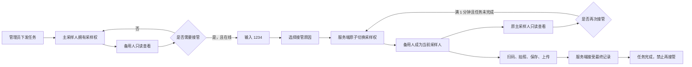

# 巴松措双人协作采样开发文档（PRD）V1.1

> 文档状态：产品规则已确认，待进入开发
>
> 目标版本：建议作为 `v1.6.0`
>
> 开发基线：GitHub `main` / `v1.5.0`，提交 `797a7dfd85adaa685271aa88926645d32dccf4d8`
>
> 关联文档：[APP 藏汉双语轻量改造 V2](./app-bilingual-ui-development-spec-v2.md)、[管理员端与二维码标签改造 V1](./admin-platform-bilingual-and-qr-label-development-spec-v1.md)

## 1. 摘要

同一个采样任务可以下发给两名采样人：一名主采样人和一名可选的备用采样人。任意时刻只允许一人拥有采样权，另一人可以在 APP 内查看实时进度，并在联网状态下输入确认码 `1234` 接管任务。

接管不创建新任务，也不更换样品编号或二维码。两部手机产生的轨迹、扫码、照片和时间记录合并到同一个任务中；系统只统计一份样品，并保留完整的人员、设备和接管审计信息。管理员还可以在任务下发后，从任务列表或任务详情重新生成并打印有效的双语二维码标签。

## 2. 联系人与职责

| 角色 | 负责人 | 职责 |
| --- | --- | --- |
| 产品负责人 | 项目管理员 | 确认现场流程、默认备用人和验收结果 |
| 藏文审核 | 当地藏语母语人员 | 审核所有新增藏文，不以机器翻译直接上线 |
| Android 开发 | 待指定 | 双人任务、实时查看、接管、离线证据与本地迁移 |
| 服务端开发 | 待指定 | 权限、并发控制、事件合并、接口、数据库和审计 |
| 管理站开发 | 待指定 | 双人下发、逐点调整、已下发任务标签打印、任务详情和导出 |
| 测试负责人 | 待指定 | 双机、断网、接管冲突、数据合并和回归测试 |

## 3. 背景

### 3.1 使用场景

项目管理员大多数时候安排当地村民外出采样，但偶尔会亲自到现场采样。任务数据必须保持统一，不能因为人员变化而出现两份任务、两套编号或互相覆盖的数据。

现场网络可能不稳定。主采样人需要能离线继续工作；备用采样人需要看到最后一次已同步的进度，并在确有需要时直接接管。

### 3.2 当前系统限制

当前 `v1.5.0` 的一个任务只有一个 `villager_id`。移动端同步只把任务发给这一名采样员，任务开始后主要通过 `locked_device_id` 锁定设备。管理员只能改期，不能给任务设置第二名采样人，也没有参与人之间的接管接口。

当前系统已经支持：

- APP 藏汉双语和统一 Material Symbols Rounded 图标。
- 地图、左侧日期任务列表、上传状态、扫码、拍照和离线保存。
- 轨迹、实时位置、任务锁、证据上传和管理员审核。
- 一个任务保存多条记录，并用唯一主记录防止重复计数。
- 下发成功后立即下载标签，以及在单个任务详情下载标签。

现有标签入口不够集中。管理员关闭下发窗口后，缺少从已下发任务列表批量选择并补打标签的清晰流程，也缺少统一的重复打印提示和批次结果说明。

本次在这些能力上增量开发，不重做现有页面结构。

### 3.3 已确认原则

1. 每个任务最多两名被指派人员：主采样人和备用采样人。
2. 备用采样人可为空，且不能与主采样人相同。
3. 系统可设置默认备用采样人，通常是管理员的 APP 采样账号。
4. 管理员网页账号和管理员的 APP 采样账号是两个身份。
5. 任意时刻只有一人拥有采样权。
6. 备用采样人可以查看进度，但不能在未接管时扫码、拍照、保存或提交。
7. 接管无需原采样人批准，但必须联网、输入 `1234` 并选择原因。
8. 两名参与人允许反复接管；两次成功接管之间冷却 1 分钟。
9. 已提交完成或已取消的任务不能再接管，也不能更改参与人。
10. 两个人的数据合并显示，不清除原采样人的扫码、照片或轨迹。
11. 已下发且仍有效的任务可以随时单个或批量打印标签；重复打印要提示，但不能阻止管理员补打。

## 4. 目标

### 4.1 产品目标

- 管理员一次下发同一任务给两名明确的参与人。
- 主采样人无法继续时，备用人可以快速接替，不需要重建任务或重打标签。
- 防止两部手机同时取得有效采样权或互相覆盖最终记录。
- 所有有效证据均保留，并能说明“谁、用哪台设备、在什么时候做了什么”。
- 保持藏文优先、汉文辅助、图标配合的现有界面规则。
- 管理员关闭下发窗口后，仍可从任务列表或详情打印、补打有效标签。

### 4.2 成功指标

首个正式版本上线后，以一个完整采样周期为观察单位：

- 100% 的双人任务只能产生一条最终样品记录。
- 100% 的接管操作包含发起人、原采样人、新采样人、原因、时间和设备信息。
- 两台设备同时点击接管时，服务端只允许一个请求成功。
- 离线补传不能覆盖当前采样人、最终完成人或已完成状态。
- 管理端可在一个详情页查看两人的全部有效照片、轨迹分段和事件时间线。
- 新增关键操作的藏文覆盖率达到 100%，且均经过母语人员审核。
- 任意有效的已下发任务都能重新生成标签；批量标签中的编号和二维码与任务当前有效数据 100% 一致。

## 5. 目标用户与使用场景

### 5.1 主采样人

默认拥有采样权。可以开始前往、定位、扫码、拍照、本地保存和上传。接管后会变为查看者，但仍能查看同一任务，并可以按规则重新接管。

### 5.2 备用采样人

通常是管理员的 APP 采样账号，也可以是另一名村民。任务未接管时只查看进度；需要替代主采样人时，输入确认码并选择原因后直接接管。

### 5.3 管理员网页账号

负责设置默认备用人、下发任务、调整参与人、查看实时进度、查看合并证据、审核和导出。网页管理员身份本身不能绕过 APP 的定位、扫码、拍照和上传规则。

### 5.4 主要限制

- 山区可能长时间断网。
- 两部手机的本地状态可能不同步。
- 藏民对汉文理解有限，新增页面必须藏文为主、汉文为辅。
- `1234` 只用于防误触，不是身份认证密码，也不能代替登录与设备授权。

## 6. 用户价值

| 用户需要 | 本方案提供的价值 |
| --- | --- |
| 村民按原任务完成采样 | 不改变编号、标签和四步采样主流程 |
| 管理员临时自己采样 | 管理员的 APP 账号可作为默认备用人并直接接管 |
| 了解对方做到哪一步 | 在任务详情看到当前人员、步骤、位置、轨迹和最后更新时间 |
| 网络不好也不能丢数据 | 两部手机的本地证据均可补传并合并保存 |
| 数据只能算一份 | 一个任务 ID、一个样品编号、一条最终记录 |
| 事后能说清责任 | 每个事件标记人员、设备、发生时间和服务器接收时间 |
| 下发后忘记打印或标签损坏 | 可从历史任务中单个或批量补打，不必重新下发任务 |

## 7. 解决方案

### 7.1 总体业务模型

每个任务有四类人员字段：

- `主采样人`：任务下发时明确指定，后续统计中始终保留。
- `备用采样人`：可选；有查看和发起接管的资格。
- `当前采样人`：此刻唯一拥有采样权的人。
- `最终完成人`：服务端接受最终提交时的当前采样人。

主采样人和备用采样人的角色名称不随接管交换。变化的只是“当前采样人”。这样可以保留最初的任务安排，也能准确表示后来由谁完成。



### 7.2 权限矩阵

| 操作 | 当前采样人 | 另一名参与人 | 管理员网页账号 |
| --- | :---: | :---: | :---: |
| 查看任务和合并进度 | 是 | 是 | 是 |
| 查看最近位置和已上传轨迹 | 是 | 是 | 是 |
| 开始前往、扫码、拍照、保存 | 是 | 否 | 否 |
| 上传最终记录 | 是 | 否 | 否 |
| 在线发起接管 | 不适用 | 是 | 否 |
| 调整主/备用人员 | 否 | 否 | 是 |
| 审核和导出 | 否 | 否 | 是 |

只有任务中已经指定的两名参与人可以在 APP 看见任务。其他采样员不能搜索、查看或接管该任务。若需要第三人，管理员必须先把该人设置为备用采样人。

### 7.3 管理端：默认备用人设置

在“采样员管理”或“项目设置”增加“默认备用采样人”：

- 每个项目可设置一人，也可以不设置。
- 默认值通常选管理员的 APP 采样账号。
- 停用该账号时，系统同时清空对应的默认设置，并提示管理员重新选择。
- 该设置只影响以后打开的下发窗口，不批量修改已下发任务。

管理员若要亲自采样，必须先建立并激活独立的 APP 采样账号。该账号与普通采样员一样遵守单有效设备、定位、轨迹、扫码、拍照和上传规则。

### 7.4 管理端：任务下发

保留现有“选择点位并生成任务”的结构，增加“批量默认 + 单点覆盖”。

#### 批量默认区

1. 选择主采样人，必填。
2. 自动带出项目默认备用采样人，可修改或清空。
3. 选择日期和计划时间。
4. 勾选采样点。

#### 单点覆盖

每个已选点位提供“调整人员”按钮。管理员可以只修改该点的主采样人或备用采样人，其余点继续使用批量默认值。

提交前必须检查：

- 主采样人和备用采样人不能相同。
- 两个账号必须启用。
- 备用采样人允许为空。
- 页面应明确显示每个点最终使用的两名人员，不能只显示批量默认值。

一次下发生成的每个样本类型仍是独立任务，但各自使用同一组人员设置。样品编号、二维码内容和标签排版规则不变。

### 7.5 管理端：下发后调整人员

- 任务尚未产生任何采样事件时，管理员可修改主采样人和备用采样人。
- 任务已有进度但未完成时，主采样人身份锁定，只能更换尚未取得当前采样权的备用采样人。新的备用人随后可在 APP 内执行接管。
- 如果备用采样人此时正是当前采样人，则不能直接替换；应先由原主采样人重新接管，再由管理员更换备用人。
- 更换人员必须填写原因，并写入任务时间线和审计日志。
- 被移出的人员立即失去查看和接管资格，但其历史证据继续保留。
- 已完成、已取消的任务不能调整人员。
- 更换人员不改变任务 ID、样品编号、二维码或标签，无需重新打印。

### 7.6 管理端：已下发任务标签打印

已下发任务的标签打印是正式功能，不只存在于“下发成功”弹窗中。

#### 打印入口

- 下发成功弹窗继续保留“下载双语标签 PDF”。
- 每个任务详情保留“打印/补打标签”。
- 任务列表增加复选框和“打印所选标签”按钮。
- 管理员可以先按项目、日期、状态、点位或采样人筛选，再选择一个或多个任务。
- 选择结果区显示任务数量、标签数量和预计 A4 页数；每页仍为 90 枚。

#### 可打印范围

- `已下发`、`采样中`、`已保存待上传`和`已完成`任务都允许打印。
- 已取消任务不允许打印，按钮置灰并显示“任务已取消”。
- 已删除任务不再出现在列表中，也不能通过旧链接生成标签。
- 采样点已删除但任务因证据链仍保留时，默认禁止新打印，并提示管理员联系系统维护人员核对。
- 改期后的任务只能生成当前有效编号和当前 `qr_token` 对应的标签。页面必须提示旧标签已经失效。

#### 重复打印

- 首次生成 PDF 时直接下载。
- 任务已有生成记录时，显示“已生成标签 PDF N 次，最近一次为某时”。
- 再次打印时弹出确认：“这是补打标签，请销毁或隔离旧标签，避免重复贴瓶。”
- 管理员确认后允许继续，不因为已经打印过而阻止补打。
- 打印或补打不改变任务状态、人员、样品编号、二维码、接管次数和审核状态。

系统只能确认“标签 PDF 已成功生成”，不能确认纸张是否真的从打印机输出。因此管理端的统计文字统一使用“PDF 生成次数”，不写成“实际打印次数”。

#### 批量规则

- 同一批次至少选择 1 个任务，最多选择 500 个任务。
- PDF 按任务列表当前排序生成，方便管理员按日期和点位整理。
- 服务端必须一次性校验全部任务。存在已取消、已删除或无权访问的任务时，整批不生成，并返回具体任务编号。
- PDF 生成成功后，才为每个任务增加一条 `label_prints` 记录并写入管理员审计日志。
- 下载失败或 PDF 渲染失败时不能增加生成次数。
- 一批任务中即使有相同点位或相同样本类型，也必须按任务逐枚生成，不合并二维码。

#### 标签内容

标签继续遵守既有图形化藏汉双语规范，至少包含：

- 样本类型统一图标。
- 藏文样本名称主行。
- 汉文样本名称辅行。
- 完整 `sample_code`。
- 历史点位序号。
- 与当前任务一致的二维码。

主采样人、备用采样人和当前采样人不印在瓶身标签上。人员变化不会导致标签失效，也不需要重新打印。

### 7.7 APP：任务列表

保持现有“左侧日期、右侧任务”的结构，不做大改。

任务卡增加：

- 主采样人头像/人员图标和姓名。
- 备用采样人头像/人员图标和姓名；没有备用人时不占空间。
- 当前采样人状态。
- 本人角色徽标：`主采样人` 或 `备用采样人`。
- 非当前采样人看到明显的“查看进度”状态，不显示可直接采样的主按钮。

状态仍使用“图标 + 藏文主行 + 汉文辅行”，不用颜色单独表达。

### 7.8 APP：实时进度查看

两名参与人进入任务详情后都能看到：

- 当前采样人。
- 当前步骤。
- 在线/离线状态和最后更新时间。
- 当前采样人距点位的距离。
- 最近一次已上传的位置。
- 已上传轨迹，按人员和接管次数分段显示。
- 已扫码、已拍照、已保存待上传、已上传等事件。

不显示手机号或其他无关隐私信息。

刷新规则：

- 任务详情打开时，每约 15 秒拉取一次进度。
- 当前采样人工作时，每约 30 秒上传一次实时位置；现有轨迹上传规则继续保留。
- 退出详情页后停止 15 秒轮询。
- 不增加短信、微信、额外推送或长期后台刷新。
- 重新打开 APP 或任务详情时立即同步。
- 断网时显示“最后同步于某时”，不能把旧状态显示成实时状态。

### 7.9 APP：进度自动产生

不要求采样员手工填写进度。APP 根据现有操作自动记录事件：

| 事件 | 触发条件 | 页面状态 |
| --- | --- | --- |
| `journey_started` | 点击开始前往 | 正在前往 |
| `arrived` | 定位进入 30 米范围 | 已到点 |
| `qr_scanned` | 二维码校验成功 | 已扫码 |
| `photo_captured` | 现场相机拍照成功 | 已拍照 |
| `record_saved_local` | 数据写入手机数据库 | 已保存待上传 |
| `record_submitted` | 服务端接受最终记录 | 已上传 / 已完成 |

每个事件至少保存：任务 ID、客户端事件 ID、事件类型、采样员 ID、设备 ID、发生时间、服务器接收时间、采样权版本。客户端事件 ID 用于重复上传去重。

### 7.10 APP：接管流程

非当前采样人点击“接管采样”后：

1. APP 先确认网络可用，并拉取最新任务状态。
2. 弹出双语风险说明：接管后本人可采样，对方变为查看者。
3. 输入固定确认码 `1234`。
4. 选择接管原因。
5. APP 带当前采样权版本向服务端提交。
6. 服务端成功后，两部手机在下次同步时更新角色。

接管原因固定为：

- 主采样人无法到达。
- 手机或设备故障。
- 无法联系主采样人。
- 行程安排变化。
- 管理员到场替代。
- 其他；选择后必须填写说明。

接管规则：

- 必须是当前任务的非当前参与人。
- 必须联网，离线时按钮置灰并说明原因。
- 每次都要输入 `1234`，不可使用“记住确认码”。
- 每次都要选择原因。
- 两次成功接管至少间隔 1 分钟。
- 允许两名参与人多次相互接管。
- 已完成、已取消任务禁止接管。
- `1234` 仅防误触。真正的权限来自已登录账号、有效设备和任务参与人关系。

### 7.11 完成边界

任务只有在服务端接受一条合法的最终记录后，才进入全局“已完成”状态。

当前采样人已经在手机本地保存、但尚未上传时，任务对服务器仍未完成，因此另一名参与人仍可在线接管。若随后发生接管：

- 旧手机排队中的内容不得丢失。
- 旧手机的记录不再自动成为最终记录。
- 它改为补传到同一任务的佐证证据。
- 新的当前采样人重新扫码、重新拍照并提交最终记录。

这条规则解决“旧手机离线保存”和“备用人急需接管”同时发生的冲突。

### 7.12 双人证据合并

一个任务从始至终保持：

- 同一个任务 ID。
- 同一个样品编号。
- 同一个二维码及 `qr_token`。
- 一条最终样品记录。

两名人员产生的内容按事件追加，不做覆盖：

- 原采样人的轨迹、扫码、照片和时间保留。
- 接管人的新轨迹、再次扫码、再次拍照和最终提交继续追加。
- 两人拍摄的照片都显示在同一任务的“现场证据”中。
- 每张照片显示拍摄人、设备、拍摄时间、接收时间和接管前后阶段。
- 地图轨迹在接管点断开，不能把两人的最后位置和第一位置画成一条直线。
- 时间线以事件发生时间排序，同时保留服务器接收时间，便于识别延迟补传。

不增加实体样品瓶交接确认，也不要求两人确认瓶子是否交接。

### 7.13 离线与延迟补传

#### 当前采样人离线

当前采样人可以继续执行原有离线流程。所有事件、轨迹、照片和最终记录先保存在手机数据库中，联网后再上传。

#### 备用人离线

备用人可以查看手机上最后一次同步到的状态，但不能离线接管。原因是服务端无法在离线时保证唯一采样权。

#### 已被接管的旧手机重新联网

旧手机恢复网络后：

- 接管前产生的轨迹、扫码和照片作为正常的接管前证据补传。
- 接管后因状态滞后继续产生的内容也保留，但标记为“接管后旧设备证据”。
- 这些内容不能改变当前采样人、当前步骤、任务完成状态或最终完成人。
- 旧手机尝试提交最终记录时，服务端返回明确的 `STALE_ASSIGNMENT`，APP 再把未上传内容转为佐证证据上传。
- APP 不应无限重试已经确定失效的最终提交。

### 7.14 管理端：合并详情

任务详情保持一条记录，新增四个区块：

1. **人员与采样权**：主采样人、备用采样人、当前采样人、最终完成人。
2. **进度时间线**：下发、前往、到点、扫码、拍照、本地保存、接管、补传、完成。
3. **轨迹分段**：按采样员、设备和采样权版本分段，可分别显示/隐藏。
4. **现场证据**：合并显示两人的照片和扫码信息。

时间线中的接管节点要突出显示“谁接替谁”和接管原因。离线延迟到达的事件按发生时间插入原位置，并带“延迟补传”标记。

### 7.15 统计与导出

- 样品数量按任务计数一次。
- `主采样人`获得参与记录。
- 实际执行过扫码、拍照、轨迹或保存的人员获得参与记录。
- 最后成功提交者记为`最终完成人`。
- 接管人获得参与记录；若最终提交，再获得完成记录。

CSV/JSON 导出增加：

- 主采样人。
- 备用采样人。
- 实际参与人，多个姓名用统一分隔符连接。
- 最终完成人。
- 接管次数。
- 接管历史摘要。

照片压缩包按一个样品目录保存全部照片，文件名加入人员 ID、事件时间和证据序号，避免同名覆盖。

### 7.16 双语和图标规范

本功能继续执行 `v1.5.0` 的视觉规范：

- 默认藏文和汉文同时显示，不提供语言选择。
- 藏文是主行，汉文是辅行。
- 新增功能图标统一使用本地打包的 Material Symbols Rounded。
- 不使用 Emoji、Unicode 字符或另一套临时图标。
- 接管使用 `swap_horiz` 或经设计确认的同义图标。
- 当前采样人使用 `person_check`；备用/查看使用 `visibility`。
- 时间线使用 `timeline`；在线/离线使用 `wifi` / `wifi_off`。
- 关键按钮必须是“图标 + 藏文 + 汉文”，不能只有图标。
- 所有新增藏文必须由当地母语人员审核后上线。

### 7.17 服务端状态模型

#### 任务状态

| 状态 | 含义 | 可接管 |
| --- | --- | :---: |
| `assigned` | 已下发，尚未开始 | 是 |
| `in_progress` | 当前采样人正在执行 | 是 |
| `saved_pending_upload` | 服务端已收到本地保存事件，但未收到最终记录 | 是 |
| `submitted` | 服务端已接受最终记录 | 否 |
| `canceled` | 管理员已取消 | 否 |

`saved_pending_upload` 只是进度提示，不代表完成。

#### 采样权版本

每个任务增加从 1 开始的 `assignment_version`。每次成功接管或管理员变更参与人时加 1。所有采样事件和最终提交都带版本号。

服务端只允许满足以下条件的最终提交成为主记录：

```text
提交人 = 当前采样人
提交设备 = 提交人的有效设备
提交版本 = 任务当前 assignment_version
任务状态不是 submitted 或 canceled
```

其他上传仍可作为证据保存，但不能成为最终记录。

### 7.18 数据库设计

现有数据必须原地迁移，不删除 `tasks.villager_id`，以兼容旧任务和旧导出。该字段继续表示最初的主采样人。

#### `tasks` 新增字段

```sql
ALTER TABLE tasks ADD COLUMN backup_villager_id INTEGER REFERENCES villagers(id);
ALTER TABLE tasks ADD COLUMN active_villager_id INTEGER REFERENCES villagers(id);
ALTER TABLE tasks ADD COLUMN final_villager_id INTEGER REFERENCES villagers(id);
ALTER TABLE tasks ADD COLUMN assignment_version INTEGER NOT NULL DEFAULT 1;
ALTER TABLE tasks ADD COLUMN handover_count INTEGER NOT NULL DEFAULT 0;
ALTER TABLE tasks ADD COLUMN last_handover_at TEXT;
```

迁移后把历史任务的 `active_villager_id` 回填为 `villager_id`。历史已提交任务的 `final_villager_id` 根据主记录对应设备的采样员回填。

#### 新增 `task_assignment_events`

记录下发、人员调整和接管：

```sql
CREATE TABLE task_assignment_events (
  id INTEGER PRIMARY KEY AUTOINCREMENT,
  task_id INTEGER NOT NULL REFERENCES tasks(id),
  event_type TEXT NOT NULL,
  from_villager_id INTEGER REFERENCES villagers(id),
  to_villager_id INTEGER REFERENCES villagers(id),
  actor_role TEXT NOT NULL,
  actor_id TEXT NOT NULL,
  reason_code TEXT NOT NULL DEFAULT '',
  reason_text TEXT NOT NULL DEFAULT '',
  assignment_version INTEGER NOT NULL,
  created_at TEXT NOT NULL DEFAULT CURRENT_TIMESTAMP
);
```

#### 新增 `task_progress_events`

```sql
CREATE TABLE task_progress_events (
  id INTEGER PRIMARY KEY AUTOINCREMENT,
  client_event_id TEXT NOT NULL UNIQUE,
  task_id INTEGER NOT NULL REFERENCES tasks(id),
  event_type TEXT NOT NULL,
  villager_id INTEGER NOT NULL REFERENCES villagers(id),
  device_id INTEGER NOT NULL REFERENCES devices(id),
  journey_id INTEGER REFERENCES journeys(id),
  assignment_version INTEGER NOT NULL,
  occurred_at TEXT NOT NULL,
  received_at TEXT NOT NULL DEFAULT CURRENT_TIMESTAMP,
  evidence_scope TEXT NOT NULL DEFAULT 'active',
  metadata TEXT NOT NULL DEFAULT '{}'
);
```

`evidence_scope` 可取：

- `active`：当前有效阶段产生。
- `pre_handover`：接管前证据延迟补传。
- `stale_after_handover`：旧设备在接管后产生，仅作佐证。

#### 新增 `task_evidence`

用于保存扫码和多张照片，不再要求一条记录只能对应一张可见照片：

```sql
CREATE TABLE task_evidence (
  id INTEGER PRIMARY KEY AUTOINCREMENT,
  client_evidence_id TEXT NOT NULL UNIQUE,
  task_id INTEGER NOT NULL REFERENCES tasks(id),
  event_id INTEGER REFERENCES task_progress_events(id),
  evidence_type TEXT NOT NULL,
  villager_id INTEGER NOT NULL REFERENCES villagers(id),
  device_id INTEGER NOT NULL REFERENCES devices(id),
  assignment_version INTEGER NOT NULL,
  occurred_at TEXT NOT NULL,
  received_at TEXT NOT NULL DEFAULT CURRENT_TIMESTAMP,
  qr_token_hash TEXT,
  photo_path TEXT,
  photo_sha256 TEXT,
  evidence_scope TEXT NOT NULL DEFAULT 'active',
  metadata TEXT NOT NULL DEFAULT '{}'
);
```

#### 轨迹分段

`journeys` 增加可空的 `task_id` 和 `assignment_version`。新版本按任务和采样权版本创建行程段。每次接管结束旧段并创建新段；管理端按段绘制，不跨段连线。

### 7.19 接口设计

所有接口继续使用现有管理员或移动端令牌。下面仅列出新增或有变化的字段。

#### 管理端

| 方法与路径 | 用途 |
| --- | --- |
| `GET /api/v1/admin/settings/sampling` | 获取项目默认备用人 |
| `PUT /api/v1/admin/settings/sampling` | 设置项目默认备用人 |
| `POST /api/v1/admin/tasks` | 创建任务，增加主/备用人字段 |
| `PUT /api/v1/admin/tasks/:id/assignees` | 调整未完成任务的人员 |
| `GET /api/v1/admin/tasks/:id/collaboration` | 获取人员、时间线、轨迹段和证据 |
| `POST /api/v1/admin/labels/pdf` | 为所选已下发任务批量生成标签 PDF |

创建任务请求示例：

```json
{
  "siteId": 5,
  "primaryVillagerId": 12,
  "backupVillagerId": 1,
  "plannedDate": "2026-09-20",
  "plannedTime": "09:00",
  "sampleTypes": ["R"]
}
```

为兼容现有调用，过渡期仍接受 `villagerId`，并把它解释为 `primaryVillagerId`。新管理站只发送新字段。

批量生成标签请求示例：

```json
{
  "taskIds": [101, 102, 108]
}
```

现有 `GET /api/v1/admin/labels?taskIds=...` 暂时保留，供旧管理站和单任务链接使用。新版管理站批量打印使用 `POST`，避免大量任务 ID 超过 URL 长度。两种接口必须共用同一个标签校验和 PDF 生成模块。

#### 移动端

| 方法与路径 | 用途 |
| --- | --- |
| `GET /api/v1/mobile/sync` | 同步本人作为主或备用的任务 |
| `GET /api/v1/mobile/tasks/:id/progress` | 获取最新协作进度 |
| `POST /api/v1/mobile/tasks/:id/progress` | 批量上传幂等进度事件 |
| `POST /api/v1/mobile/tasks/:id/evidence` | 上传扫码或照片证据 |
| `POST /api/v1/mobile/tasks/:id/takeover` | 在线接管 |
| `POST /api/v1/mobile/tasks/:id/record` | 最终提交，增加采样权版本校验 |

接管请求示例：

```json
{
  "confirmationCode": "1234",
  "reasonCode": "ADMIN_ON_SITE_REPLACEMENT",
  "reasonText": "",
  "expectedAssignmentVersion": 3,
  "clientRequestId": "0b19dce6-49c8-4dbe-9cb6-8bb7fe5fd7cc"
}
```

成功响应返回新的当前采样人、新版本和冷却结束时间。常见失败码：

| HTTP / code | 含义 |
| --- | --- |
| `403 NOT_PARTICIPANT` | 本人不是当前两名参与人 |
| `403 INVALID_CONFIRMATION_CODE` | 确认码不是 `1234` |
| `409 ASSIGNMENT_CHANGED` | 另一台手机已先完成接管，需要刷新 |
| `409 TAKEOVER_COOLDOWN` | 距上次接管不足 1 分钟 |
| `409 STALE_ASSIGNMENT` | 上传来自旧采样权版本，不能作为最终记录 |
| `422 TASK_FINISHED` | 任务已完成或已取消 |

### 7.20 并发控制

不需要在 APP 中开发通用“多线程采样”。关键是服务端用 SQLite 事务保证采样权只切换一次。

接管必须在一个 `BEGIN IMMEDIATE` 事务中完成：

1. 读取任务、参与人、当前采样人、状态、版本和最后接管时间。
2. 校验登录人、设备、`1234`、原因、冷却时间和任务状态。
3. 使用带旧版本条件的更新切换当前采样人。
4. `assignment_version + 1`、`handover_count + 1`。
5. 关闭旧轨迹段，写入接管事件和审计日志。
6. 提交事务。

核心更新应包含条件：

```sql
UPDATE tasks
SET active_villager_id = ?,
    assignment_version = assignment_version + 1,
    handover_count = handover_count + 1,
    last_handover_at = CURRENT_TIMESTAMP,
    locked_device_id = NULL,
    locked_at = NULL,
    journey_id = NULL,
    updated_at = CURRENT_TIMESTAMP
WHERE id = ?
  AND assignment_version = ?
  AND active_villager_id <> ?
  AND status <> 'submitted'
  AND canceled_at IS NULL;
```

只有 `changes = 1` 才表示接管成功。两个请求同时到达时，一个成功，另一个返回 `409 ASSIGNMENT_CHANGED`。

最终记录写入也必须在事务内以相同方式校验当前采样人和版本。不能先查询再在事务外写入。

### 7.21 本地数据库和同步

Android 本地数据库版本升级后增加：

- 任务的主、备用、当前和最终人员字段。
- `assignment_version` 和最后同步时间。
- 本地进度事件队列。
- 本地证据队列。
- 证据上传状态与失败原因。

同步顺序建议：

1. 登录并检查设备有效性。
2. 拉取服务器任务和采样权版本。
3. 上传轨迹段和普通进度事件。
4. 上传扫码与照片证据。
5. 尝试上传最终记录。
6. 若收到 `STALE_ASSIGNMENT`，停止最终记录重试，将内容转为佐证证据。
7. 再次拉取任务，刷新列表和详情。

WorkManager 继续负责网络恢复后的补传，不需要新增常驻后台服务。

### 7.22 安全、隐私与审计

- `1234` 是公开的防误触码，不作为安全凭据宣传。
- 服务端仍必须校验登录令牌、有效设备和任务参与人身份。
- 接管接口按账号、设备和任务限速，防止按钮重复提交。
- `clientRequestId`、`client_event_id` 和 `client_evidence_id` 保证重试幂等。
- 不在观察页面显示手机号、激活密钥或设备唯一标识原文。
- 审计日志记录人员 ID 和设备 ID，但普通页面只显示可读名称。
- 照片、位置和轨迹继续使用现有授权与签名链接，不能公开访问。
- 手机时间异常时同时保留客户端时间和服务器时间，并加风险标记，不能直接删除数据。
- 标签 PDF 每次成功生成都记录管理员、任务 ID、生成时间、批次数量和来源入口；二维码密钥不写入普通日志。

### 7.23 兼容与迁移

- 升级前备份 SQLite 数据库和上传目录。
- 所有新增列采用增量迁移，旧数据不删除、不重编号。
- 历史任务默认只有主采样人，备用为空，当前采样人为原 `villager_id`。
- 旧版 APP 不认识备用任务。服务端对双人任务的接管与最终提交必须强制校验，不能依赖新版 APP 自觉限制。
- 建议把支持双人协作的 Android 版本设为强制升级；否则备用人无法查看任务，旧主采样人也看不到接管状态。
- 原有单人任务创建接口在过渡期继续可用。
- 二维码协议、样品编号和已打印标签完全兼容。
- 继续使用现有 `label_prints` 表记录每个任务的 PDF 生成历史，不删除已有记录。

### 7.24 假设

以下规则已按“其余采用建议方案”定稿：

- 允许两名参与人反复接管。
- 接管冷却时间为 1 分钟。
- 本地已保存但未上传时仍允许在线接管。
- 接管后旧设备产生的数据保留为带标记的佐证，不参与最终状态计算。
- 不开发推送、短信、微信通知或长期后台观察。
- 不增加实体样品瓶交接流程。

若现场试用发现 1 分钟过短，可把冷却时间改为服务端配置；首版界面不提供管理员自由修改入口。

## 8. 发布计划

### 阶段 A：服务端和数据库

- 完成增量迁移、参与人字段、事件表和证据表。
- 实现接管事务、最终提交校验、幂等和审计。
- 完成单元测试与双请求并发测试。

### 阶段 B：管理端

- 实现默认备用人、批量默认和单点覆盖。
- 实现已下发任务的单个打印、列表批量打印、补打提示和打印历史。
- 实现人员调整、合并时间线、照片和轨迹分段。
- 更新 CSV、JSON、照片包导出。

### 阶段 C：Android

- 实现双人任务同步、查看模式、15 秒进度刷新和接管流程。
- 实现本地事件/证据队列、采样权版本和延迟补传。
- 补齐藏汉双语、统一图标和无障碍说明。

### 阶段 D：双机试运行

- 使用两台真实手机进行在线、弱网、断网和恢复网络测试。
- 使用管理员 APP 账号作为默认备用人走完正式流程。
- 由藏语母语人员验收新增文案。
- 试运行通过后再将新 APP 设为强制升级。

首个版本包含本文档全部核心规则。推送通知、三人以上协作、动态确认码和实体瓶交接均留到未来版本评估。

## 9. 测试要求

### 9.1 服务端自动化测试

- 主、备用不能相同；备用可为空。
- 只有两名参与人能同步和查看任务。
- 非参与人接管返回 `403`。
- 错误确认码返回 `403`，不改变版本。
- 两个接管请求并发时只成功一个。
- 1 分钟内再次接管返回冷却错误。
- 冷却结束后原主采样人可以接管回来。
- 完成和取消任务不能接管或换人。
- 旧版本提交不能成为最终记录。
- `clientRequestId`、事件 ID 和证据 ID 重复提交不产生重复数据。
- 一个任务始终只有一条最终主记录。
- 旧手机延迟证据可以保存，但不覆盖最终记录。
- 数据库从 `v1.5.0` 升级后历史任务正确回填。
- 标签批量接口拒绝取消、删除、越权或超过 500 个任务的请求。
- PDF 渲染失败时不写入 `label_prints`；成功时每个任务只增加一条本批次记录。
- 重复生成标签不改变任务编号、二维码、人员或状态。

### 9.2 Android 测试

- 主采样人看到采样按钮，备用人只看到查看和接管按钮。
- 断网时备用人的接管按钮不可用，并显示双语原因。
- 接管成功后双方在下一次同步正确交换当前/查看状态。
- 原主采样人接管回来时规则相同。
- 15 秒刷新只在详情页可见时运行。
- 旧手机收到 `STALE_ASSIGNMENT` 后不无限重试最终提交。
- 两部手机的照片、扫码和轨迹均能补传。
- 上传页逐条显示最终记录和证据的等待、失败、已上传状态。
- 大字体下藏文不裁切，按钮触控区域不小于 48dp。

### 9.3 管理端端到端测试

- 下发窗口自动带出默认备用人。
- 批量默认与单点覆盖结果正确。
- 任务有进度后只能替换非当前参与人。
- 详情页能看到每次接管、两人照片和断开的轨迹段。
- 延迟补传事件插入正确时间位置并有标记。
- 导出只有一条样品行，人员和接管字段完整。
- 已下发任务可从列表单选、多选打印，也可从详情单个补打。
- 已生成过标签的任务显示次数和最近时间，确认后仍可补打。
- 取消任务不能打印；改期任务只生成当前有效标签并提示旧标签失效。
- 原有单人任务、标签打印、改期、取消、审核和导出不回归。

### 9.4 必测双机场景

1. 主采样人在线工作，备用人实时查看。
2. 备用人在线接管，原主采样人立即失去采样权。
3. 两人同时点击接管，验证只有一人成功。
4. 主采样人离线拍照并保存，备用人在线接管并最终提交。
5. 原手机恢复网络，补传接管前证据。
6. 原手机恢复网络，补传接管后误产生的证据。
7. 备用人完成前，原主采样人满 1 分钟后重新接管。
8. 最终提交完成后，双方都不能再次接管。

## 10. 验收标准

- 管理员能为每个任务设置一名主采样人和一名可选备用采样人。
- 系统能自动带出默认备用人，并允许每个点单独修改。
- 两名参与人都能在 APP 看见任务，其他人看不见。
- 任意时刻服务端只有一个当前采样人。
- 备用人只有联网、输入 `1234`、选择原因后才能接管。
- 双方允许反复接管，成功接管间隔不少于 1 分钟。
- 已完成或已取消任务不能接管、换人或覆盖最终记录。
- 原采样人的扫码、照片和轨迹不会因接管而清除。
- 两人的证据在同一任务合并显示，轨迹分段且不跨段连线。
- 离线补传不能覆盖当前采样人、当前状态或最终完成人。
- 样品只统计一次，导出包含主、备用、实际参与人和最终完成人。
- 新增 APP 界面均为藏文主行、汉文辅行并使用统一图标。
- 管理员关闭下发窗口后，仍能从任务列表或任务详情打印有效的双语标签。
- 批量打印按所选任务逐枚生成二维码；重复打印有提示但允许继续。
- 标签 PDF 成功生成后记录次数和时间，生成失败不计数。
- 已取消任务不能打印，改期任务只能打印当前有效编号和二维码。
- 现有单人采样、地下水、二维码、标签、上传、审核和导出全部通过回归测试。

## 11. 预计代码改动位置

### 服务端

- `bsc-sampling-v1/src/schema.js`：增量迁移、事件表、证据表和索引。
- `bsc-sampling-v1/src/server.js`：同步范围、接管、进度、证据、最终提交、已下发任务批量标签和管理端接口。
- `bsc-sampling-v1/src/labels.js`：单个与批量任务共用的双语标签校验和 PDF 生成。
- `bsc-sampling-v1/src/exports.js`：参与人、最终完成人和接管历史。
- 建议新增 `bsc-sampling-v1/src/task-collaboration.js`：集中处理权限、接管事务、事件合并和状态计算。
- `bsc-sampling-v1/public/app.js`、`index.html`、`styles.css`：下发、任务列表批量打印、补打提示和协作详情。

### Android

- `Api.java`：进度、证据、接管和协作详情接口。
- `Store.java`：数据库升级、事件与证据队列、失效提交处理。
- `Task.java`：主、备用、当前、最终人员和采样权版本。
- `SyncEngine.java`、`SyncWorker.java`：新的补传顺序与错误分类。
- `MainActivity.java`：任务卡的本人角色和协作状态。
- `TaskActivity.java`：查看模式、实时进度、接管弹窗和双语时间线。
- `TrackingService.java`：按任务与采样权版本切分轨迹。
- `MaterialSymbols.java`、`Bilingual.java`：新增图标和双语文案。

## 12. 不在本次范围

- 三名或更多人员同时参与一个任务。
- 备用人离线接管。
- 原采样人批准后才能接管。
- 动态密码、短信验证码或人脸认证。
- 语音提示、藏语语音或文字转语音。
- 短信、微信、额外推送和长期后台观察。
- 实体样品瓶交接确认。
- 因接管重新生成编号、二维码或标签。
- 大幅改动现有地图、左侧日期任务列表、上传页和四步采样结构。

## 13. 最终产品决策清单

| 决策 | 结果 |
| --- | --- |
| 每个任务人数 | 最多 2 人 |
| 角色 | 主采样人 + 可选备用采样人 |
| 默认备用人 | 项目可配置，通常为管理员 APP 账号 |
| 同时采样人数 | 只能 1 人 |
| 备用人权限 | 实时查看；接管前不能采样 |
| 接管审批 | 不需要原采样人批准 |
| 接管确认 | 固定码 `1234` + 原因 |
| 接管网络 | 必须在线 |
| 重复接管 | 允许，冷却 1 分钟 |
| 任务完成边界 | 服务端接受最终记录 |
| 已本地保存未上传 | 仍允许另一人在线接管 |
| 原人员进度 | 全部保留，不清除 |
| 双人数据 | 同一任务合并显示 |
| 最终记录 | 只允许一条 |
| 二维码与编号 | 接管前后不变 |
| 轨迹 | 按人员和接管阶段分段，不跨段连线 |
| 离线补传 | 保留为证据，不覆盖最终状态 |
| 完成后操作 | 禁止接管和换人 |
| 已下发任务标签 | 可从任务列表或详情单个、批量打印 |
| 重复打印 | 提示旧标签风险后允许补打 |
| 标签打印限制 | 取消/删除任务禁止；改期任务只打印当前有效标签 |
| 标签人员信息 | 不打印人员，换人和接管不影响标签 |
| 语音与推送 | 不开发 |
