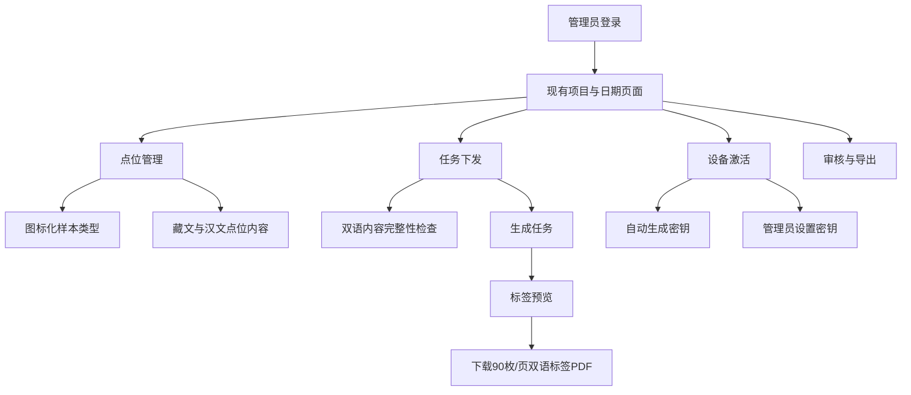

# 管理员端、图形化双语内容与二维码标签改造开发文档 V1

- 文档日期：2026-09-12
- 适用项目：巴松措水样采集系统
- 涉及范围：管理站网页、服务器接口、瓶身二维码标签 PDF、激活凭据
- 关联文档：[APP 双语界面开发文档 V2](./app-bilingual-ui-development-spec-v2.md)
- 状态：第一阶段已实现；藏文正式译文、字体部署与实物打印仍须验收

## 1. 结论

管理员端需要配套修改，但不需要推翻现有项目、日期、地图、任务、审核和设备管理结构。

必须修改的部分有五类：

1. 管理站全部功能图标统一为 Material Symbols Rounded，不再混用 Emoji、Unicode 字符和临时 SVG。
2. 管理员能够录入和检查将要显示在 APP 中的藏文点位名称、采样说明和风险提醒。
3. 样本类型在管理站使用“统一图标 + 藏文主名称 + 汉文辅名称”展示；地下水沿用 GitHub v1.4.1 已启用的完整类型链路。
4. 管理员能够选择自动生成激活密钥，或输入符合规则的自定义激活密钥。
5. 管理员打印的瓶身二维码标签改为图形化双语标签，二维码协议保持不变。

管理员本人使用的后台操作说明可以继续以汉文为主。本轮不要求把整个管理站翻译成藏文；必须双语化的是会下发给采样员、出现在 APP 或打印标签上的业务内容。

## 2. 改造目标与不变项

### 2.1 目标

- 让管理员在任务下发前确认采样员看到的图标、藏文和汉文内容。
- 保证 APP、管理站和瓶身标签对同一种样本使用同一个图标、类型码和名称。
- 让不熟悉汉文的采样员仅凭样本图标、藏文和大号编号也能选对瓶子。
- 保持二维码的机器识别可靠性，不因增加图标或藏文影响扫码。
- 所有字体和图标随部署包本地提供，山区断网时仍可生成标签。

### 2.2 必须保持不变

- 保留现有左侧项目与日期、地图/表格切换、任务下发、审核、导出和设备管理主结构。
- 不改变任务、照片、轨迹、审核和审计证据链。
- 不改变二维码载荷格式：`BSC-SAMPLE|sample_code|qr_token`。
- 不把样本图标、藏文或其他装饰绘制到二维码及其留白区内。
- 不引入 CDN、在线字体、运行时图标下载或在线翻译。
- 不删除已有汉文数据；新增藏文字段采用兼容式数据库迁移。
- 不回退 GitHub v1.4.1 已加入的地下水类型；继续对其图标、藏文、标签和 APP 全链路做同等验收。

## 3. GitHub 基线问题与本轮处理结果

| 项目 | GitHub v1.4.1 基线 | 本轮处理结果 |
| --- | --- | --- |
| 管理站图标 | 使用字符和自制水滴 SVG | 主要功能与样本图标统一改为本地 Material Symbols Rounded |
| 样本类型名称 | 分散保存汉文名称 | 新增 `src/sample-types.js`，集中保存藏文、汉文、图标和颜色 |
| 点位业务内容 | 只有汉文 `name`、`instructions`、`risk_note` | 新增三个藏文字段、兼容迁移、表单与同步接口；正式译文和完整性门禁待母语审核后启用 |
| 激活密钥 | 只由服务器自动生成 | 已支持“自动生成/管理员设置安全 8 位密钥”两种方式 |
| 瓶身标签 | 33.6 × 19.8mm，6 列 × 15 行，即 A4 每页 90 枚 | 保留规格并改为图标 + 藏文主名称 + 汉文 + 完整编号 |
| 标签字体 | 从 Windows 系统寻找中文字体 | 已支持 `LABEL_FONT_PATH` 与 `LABEL_TIBETAN_FONT_PATH`；生产字体文件和实物打印待部署验收 |
| 标签内容 | 二维码 + 基础编号 + 汉文类型 + 点位 | 已增加样本图标和藏文，可见编号改为完整 `sample_code` |
| 地下水 | v1.4.1 已正式加入 `G` 类型 | 保持启用，并进入统一图标、藏文、标签和测试链路 |

README、`labels.js`、管理站文案和测试现已统一为每页 90 枚（33.6 × 19.8mm，6 列 × 15 行），采购与打印均以此规格为准。

## 4. 管理员端信息架构

现有信息架构保留，仅在原入口内增加必要能力：



不新增一级导航。点位、任务、标签和设备能力继续放在当前入口内，减少管理员重新学习成本。

## 5. 统一图标系统

### 5.1 图标来源

管理站与 APP 使用同一套 Google 官方 **Material Symbols Rounded**：

- 官方指南：[Material Symbols guide](https://developers.google.com/fonts/docs/material_symbols)
- 官方仓库：[google/material-design-icons](https://github.com/google/material-design-icons)
- 授权：[Apache License 2.0](https://github.com/google/material-design-icons/blob/master/LICENSE)
- 首次导入固定到提交 `40a7a292a79d9394157e1ea24f83d52d5e17c556`

网页端不得调用 Google Fonts 网络服务。当前实现把审核后的 SVG path 固化在 `public/icons.js`，并通过统一的 `icon(name)` 与 `decorateMaterialIcons()` 输出；PDF 标签复用 `src/sample-types.js` 中相同来源的样本图标路径。业务模板不得自行粘贴或绘制另一套路径。

### 5.2 管理站主要替换清单

| 管理站功能 | Material Symbols Rounded 名称 |
| --- | --- |
| 新建 | `add` |
| 地图/点位管理 | `map` / `location_on` |
| 在地图选点 | `add_location_alt` |
| 任务 | `assignment` |
| 下发任务 | `assignment_add` |
| 表格 | `table_view` |
| 上传/导入 | `upload_file` |
| 下载/导出 | `download` |
| 打印标签 | `print` |
| 二维码 | `qr_code_2` |
| 扫码 | `qr_code_scanner` |
| 采样员 | `badge` |
| 设备激活 | `phonelink_setup` |
| 密钥 | `key` |
| 刷新/同步 | `refresh` / `sync` |
| 审核通过 | `check_circle` |
| 标记可疑 | `warning` |
| 退回重采 | `restart_alt` |
| 删除 | `delete` |
| 关闭 | `close` |
| 更多 | `more_vert` |
| 诊断日志 | `description` |
| 设置 | `settings` |

状态不能只靠颜色表示。审核通过、待审核、可疑、退回和未采样应同时具有不同图标、状态文字与颜色。

### 5.3 样本类型图标

| 类型码 | Material Symbols Rounded | 汉文 | 藏文资源键 | 上线状态 |
| --- | --- | --- | --- | --- |
| `R` | `waves` | 河水 | `sample.river.bo` | 启用 |
| `T` | `alt_route` | 支流 | `sample.tributary.bo` | 启用 |
| `L` | `landscape` | 湖水 | `sample.lake.bo` | 启用 |
| `Y` | `rainy` | 雨水 | `sample.rain.bo` | 启用 |
| `S` | `compost` | 土壤 | `sample.soil.bo` | 启用 |
| `P` | `potted_plant` | 植物 | `sample.plant.bo` | 启用 |
| `G` | `water_pump` | 地下水 | `sample.groundwater.bo` | v1.4.1 已启用 |

藏文资源键在本文档中不填机器翻译结果。正式译文必须经当地母语采样员确认后写入类型目录，并记录审核人、审核日期和版本。

## 6. 点位管理的双语内容

### 6.1 表单调整

点位弹窗保持现有布局，在以下三个字段中采用上下成对输入：

| 汉文字段 | 新增藏文字段 | 要求 |
| --- | --- | --- |
| 点位名称 `name` | 点位藏文名称 `name_bo` | 正式项目必填 |
| 采样说明 `instructions` | 藏文采样说明 `instructions_bo` | 汉文有内容时必填 |
| 风险提醒 `risk_note` | 藏文风险提醒 `risk_note_bo` | 汉文有内容时必填 |

表单先显示藏文输入框，再显示汉文输入框，并在右侧提供“APP 预览”。预览必须与 APP 一致：藏文为主行，汉文为辅行，样本类型同时显示图标。

管理员可以暂存不完整点位，但存在以下任一情况时不得为正式项目创建新任务：

- 缺少点位藏文名称。
- 汉文采样说明存在但藏文采样说明为空。
- 汉文风险提醒存在但藏文风险提醒为空。
- 选择了没有审核通过藏文名称的样本类型。

测试项目可以跳过阻断，但必须显示明显的“藏文未完成”徽标。

### 6.2 数据库迁移

在 `sites` 表追加以下兼容字段：

```sql
ALTER TABLE sites ADD COLUMN name_bo TEXT NOT NULL DEFAULT '';
ALTER TABLE sites ADD COLUMN instructions_bo TEXT NOT NULL DEFAULT '';
ALTER TABLE sites ADD COLUMN risk_note_bo TEXT NOT NULL DEFAULT '';
```

迁移不得修改或覆盖现有汉文数据。上线前生成一次“缺少藏文内容的启用点位”清单，由管理员补齐。

### 6.3 接口调整

管理站点位新增和修改接口增加：

```json
{
  "name": "汉文点位名称",
  "nameBo": "经审核的藏文点位名称",
  "instructions": "汉文采样说明",
  "instructionsBo": "经审核的藏文采样说明",
  "riskNote": "汉文风险提醒",
  "riskNoteBo": "经审核的藏文风险提醒"
}
```

移动端同步任务增加兼容字段：

```json
{
  "site_name": "汉文点位名称",
  "site_name_bo": "藏文点位名称",
  "instructions": "汉文采样说明",
  "instructions_bo": "藏文采样说明",
  "risk_note": "汉文风险提醒",
  "risk_note_bo": "藏文风险提醒"
}
```

旧版 APP 会忽略新增字段；新版 APP 同时展示藏文和汉文。

## 7. 任务下发页面

### 7.1 点位选择列表

每个点位继续使用多选框，但内容改为：

```text
[勾选] [样本图标] 藏文点位名称
                    汉文点位名称 · 历史序号 · 样本类型图标
```

地下水 `G` 与其余六种类型使用同一套目录、选择器、任务生成和标签入口，不再单独隐藏。后续如因业务原因需要停用，应增加由服务器强制执行的通用样本类型启用策略，不能只在前端隐藏入口。

### 7.2 下发前检查

点击“生成任务和二维码”后，服务器在写入任务前统一检查：

1. 点位已经启用且未删除。
2. 采样员账号已启用。
3. 藏文业务内容完整。
4. 样本类型已启用。
5. 样本类型存在于服务器统一目录中（包括 v1.4.1 已启用的地下水 `G`）。

若检查失败，返回具体点位和缺失字段，不使用笼统的“创建失败”。

### 7.3 生成结果与标签预览

任务创建成功后，原有结果区增加一张真实尺寸的标签预览，并显示：

- 预计生成标签数量。
- A4 页数，按每页 90 枚向上取整。
- 标签纸规格：33.6 × 19.8mm，6 列 × 15 行。
- 打印提示：“打印比例 100%，关闭适合页面/缩放”。
- “下载双语标签 PDF”主按钮。
- “先打印一页测试”次按钮；任务超过一页时只生成第一页用于校准。

## 8. 瓶身二维码标签改造

### 8.1 默认规格

为减少现场耗材和操作变化，V1 保留现有 A4 每页 90 枚模板：

| 参数 | 固定值 |
| --- | --- |
| 单枚标签 | 33.6 × 19.8mm |
| 排版 | 6 列 × 15 行 |
| 每页 | 90 枚 |
| 页面 | A4，210 × 297mm |
| 打印比例 | 100%，禁止适合页面 |
| 二维码 | 黑底白底，不使用彩色二维码 |

若母语人员在物理样张上确认藏文字号不可读，再另立“大号标签模板”，不得在没有打印验证的情况下直接缩小藏文字号。

### 8.2 单枚标签布局

```text
┌─────────────────────────────────┐
│ ┌──────────────┐  [样本图标] 藏文样本名称 │
│ │              │             汉文样本名称 │
│ │    二维码     │  260912-R-5.1-01        │
│ │              │  点位 5.1                │
│ └──────────────┘                         │
└─────────────────────────────────┘
```

布局优先级从高到低：

1. 完整且可扫描的二维码。
2. 与二维码载荷一致的完整 `sample_code`。
3. 样本图标和藏文样本名称。
4. 汉文样本名称。
5. 历史点位序号。

空间不足时先省略点位全名，不能缩小二维码、隐藏完整编号或删掉藏文样本名称。

### 8.3 二维码规则

- 二维码内容继续为 `BSC-SAMPLE|sample_code|qr_token`。
- 二维码实际绘制尺寸建议为 15.5—16.0mm，包含生成器提供的完整留白。
- 二维码四周不得放置边框、图标、色块、文字或裁切线。
- 不在二维码中心嵌入 Logo 或样本图标。
- PDF 导出不得对二维码进行有损 JPEG 压缩。
- 每个标签的可见完整编号必须与二维码中的 `sample_code` 完全一致。
- 改期生成新编号和新密钥后，旧标签继续按现有规则作废并重新打印。

当前 `labelText()` 优先打印 `base_sample_code`，必要时还会去掉末尾两位顺序号。该行为必须改为打印完整 `sample_code`，否则二维码损坏后的人工输入无法与 APP 期望的任务编号一致。

### 8.4 图标和颜色

- 标签样本图标与 APP 使用同一 Material Symbols Rounded 路径。
- 图标不得使用 Emoji，避免打印设备替换字形。
- 默认采用深青黑单色；同时必须通过纯黑白激光打印测试。
- 图标只是辅助识别，旁边始终显示经审核的藏文与汉文样本名称。
- 同点位数量角标可以保留，但不得覆盖样本图标或完整编号。

### 8.5 字体与藏文排版

服务器部署包固定携带两套字体，不再依赖 Windows 字体目录：

- 藏文：建议使用官方 [Noto Tibetan](https://github.com/notofonts/tibetan) 中经过项目测试的固定版本。
- 汉文：打包经过许可、覆盖简体中文的本地字体。
- Noto 字体采用 SIL Open Font License；字体文件、版本和授权文件一并归档。

PDFKit 中分别注册 `LabelTibetan` 和 `LabelCjk`。藏文行不得使用字符数截断；必须按实际字形宽度测量，并验证上下叠字、元音符号和行高没有被裁切。

藏文样本名称建议不小于 7.5pt；汉文辅行建议不小于 5.5pt；完整编号建议不小于 6.5pt。最终以 100% 比例物理打印后的母语人员验收为准。

### 8.6 标签数据模型

`labelText(task)` 调整为返回：

```js
{
  code: task.sample_code,
  typeCode: task.sample_type,
  typeBo: sampleType.nameBo,
  typeZh: sampleType.nameZh,
  icon: sampleType.icon,
  siteCode: task.site_code
}
```

样本类型名称、图标和启用状态应由单一 `SampleTypeCatalog` 提供。管理站、任务接口和 `labels.js` 不再各自维护一份容易漂移的 `TYPE_NAMES`。

## 9. 激活密钥管理

现有“设备激活”弹窗内增加两种互斥方式：

1. 自动生成密钥。
2. 管理员设置 8 位数字密钥。

请求继续使用：

`POST /api/v1/admin/villagers/:id/activation`

请求体扩展为：

```json
{
  "mode": "initial",
  "currentDeviceId": null,
  "activationKey": "58302741"
}
```

`activationKey` 为空时继续自动生成。自定义密钥必须一次性、24 小时有效、只保存 SHA-256 哈希，并拒绝全相同、连续递增/递减和常见弱密钥。明文只能在创建成功后显示一次，不写入普通日志或审计详情。

激活二维码卡片统一使用 `qr_code_2`、`badge` 和 `key` 图标，可显示账号、有效期和简短双语交付提示，但二维码本体周围仍须保持空白。

## 10. 地下水全链路验收

GitHub v1.4.1 已加入地下水类型，本次不再将其默认关闭。发布时必须确认：

- 服务器任务类型白名单支持 `G`。
- 管理站点位、任务、标签、详情和导出支持 `G`。
- APP 地图、任务、扫码、拍照水印、上传和详情支持 `G`。
- 当前暂定藏文名称已替换为母语审核版本。
- 标签图标和字体完成实物打印验收。
- 自动化测试覆盖创建、同步、扫码、上传、审核和导出。

服务器通过统一 `SampleTypeCatalog` 校验类型码；管理站、移动端同步和标签生成均读取同一目录。若未来增加类型停用能力，服务器仍应是最终控制点，前端隐藏入口不能代替服务器校验。

## 11. 建议的代码与资源组织

### 11.1 新增

- `bsc-sampling-v1/src/sample-types.js`：样本类型码、双语名称、图标、启用规则。
- `bsc-sampling-v1/public/icons.js`：管理站本地 Material Symbols Rounded 图标路径与渲染函数。
- `bsc-sampling-v1/THIRD_PARTY_NOTICES.md`：图标和字体来源、版本、固定提交。

### 11.2 修改

- `public/index.html`：替换字符图标，增加双语点位输入、标签预览和自定义密钥控件。
- `public/app.js`：统一 `icon()` 渲染、双语预览、完整性检查提示和标签预览。
- `public/styles.css`：图标尺寸、双语字段、样本卡和标签预览样式。
- `src/schema.js`：追加三个藏文点位字段。
- `src/server.js`：点位双语字段、同步字段、统一类型校验、自定义激活密钥。
- `src/device-policy.js`：集中处理自定义密钥验证、哈希、一次性和有效期。
- `src/labels.js`：双字体、样本图标、双语排版、完整编号和打印安全区。
- `test/labels.test.js`、`test/api.test.js`、`test/frontend.e2e.js`：补充对应测试。
- `README.md`：把错误的“40 枚/页”统一为实际的“90 枚/页”。

## 12. 开发顺序

### 阶段 A：共用字典和资源

1. 由母语人员确认七种样本名称和核心标签短语。
2. 建立 `SampleTypeCatalog`。
3. 固定 Material Symbols Rounded 和字体版本。
4. 把图标和授权说明放入部署包，并由生产环境显式配置已授权的藏文与汉文字体路径。
5. 验证地下水 `G` 在 v1.4.1 的服务器、APP、标签和审核链路中保持可用。

### 阶段 B：点位与任务

1. 增加数据库藏文字段。
2. 修改点位接口和移动端同步字段。
3. 修改点位弹窗和 APP 预览。
4. 增加正式任务发布前的双语完整性检查。

### 阶段 C：二维码标签

1. 将可见编号改为完整 `sample_code`。
2. 引入双字体和七种已启用样本图标。
3. 完成 90 枚/页双语模板。
4. 增加标签预览和单页测试打印。
5. 进行软件解码、物理打印和母语可读性验收。

### 阶段 D：激活与图标

1. 实现管理员设置密钥和自动生成密钥。
2. 替换管理站全部字符/Emoji 功能图标。
3. 完成管理站全页面截图回归。

## 13. 测试要求

### 13.1 样本和双语内容

- 七个类型码的图标、藏文、汉文映射唯一且一致。
- 正式项目缺少必需藏文内容时不能创建任务。
- 测试项目允许继续，但始终显示未完成警告。
- 旧版 APP 能忽略新增同步字段并继续运行。
- 新版 APP 同时正确显示藏文和汉文。

### 13.2 标签自动化测试

- `labelText()` 对所有类型返回完整 `sample_code`。
- 每页第 90 枚不越界，第 91 枚进入下一页。
- 所有标签二维码从渲染后的 300dpi 页面图片中裁切后均可解码。
- 解码结果与对应 `sample_code`、`qr_token` 完全一致。
- 长编号、`5.1` 等历史序号、同点位角标和最长藏文名称不重叠。
- 字体文件缺失时明确失败，不能静默换成不支持藏文的系统字体。
- 纯黑白打印模式下图标、文字和二维码仍可区分。

### 13.3 实物打印验收

使用实际标签纸、实际打印机和 OPPO Find X7：

1. 以 100% 比例打印至少一整页。
2. 从页面四角、中心和边缘随机抽取不少于 20 枚扫码。
3. 所有抽检二维码一次扫描成功，且返回正确任务。
4. 标签贴到弧形瓶身后再次抽检不少于 10 枚。
5. 当地母语人员确认藏文名称清楚、未裁切、图标含义可理解。
6. 人为损坏二维码后，能够根据可见的完整编号走现有人工输入流程。

### 13.4 管理站回归

- 登录、项目切换、日期切换、地图、表格和详情正常。
- 点位新增、编辑、导入和删除正常。
- 任务下发、标签下载、取消、删除和改期正常。
- 审核、批量审核、天气补齐和所有导出正常。
- 设备首次激活、换机、失效、自动密钥和自定义密钥正常。
- 浏览器控制台无 CSP、字体、SVG 或资源路径错误。

## 14. 验收标准

- 管理站不再使用 Emoji 或 Unicode 字符充当功能图标。
- 管理站、APP 和标签使用同一套样本图标与类型码。
- 所有下发给采样员的动态点位内容都有经审核的藏文和汉文。
- 标签包含样本图标、藏文主名称、汉文辅名称、完整编号和二维码。
- 标签二维码协议未改变，旧任务和旧 APP 的扫码兼容性不受影响。
- 标签在 90 枚/页、100% 打印比例下无越界、无藏文字形缺失且扫码通过。
- 自定义激活密钥满足一次性、限时、哈希存储和审计安全要求。
- 地下水 `G` 在管理站、同步接口和标签中与其他类型一致，且不回退 v1.4.1 的既有支持。
- 所有新增图标均为本地资源；生产标签字体通过本地路径提供，断网可用，来源和授权已归档。
- 现有服务器测试与 Playwright 管理站端到端测试全部通过。

## 15. 本轮不做

- 不把整个管理员后台翻译为藏文。
- 不加入语音、在线翻译或文字转语音。
- 不修改二维码载荷和现有扫码安全校验。
- 不重构为 Vue、React 或其他前端框架。
- 不回退或隐藏 v1.4.1 已开放的地下水类型。
- 不因界面改造删除历史数据、打印记录或审计记录。
