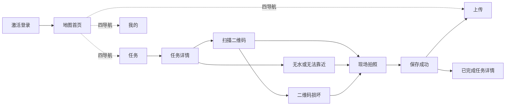

# 巴松措采样 APP 藏汉双语轻量改造开发文档 V2

> 状态：第一阶段代码已实现；藏文母语审核、字体打包、截图回归与真机验收待完成
> 适用范围：原生 Android 采样端，以及“管理员设置激活密钥”所需的管理站与服务器改动
> 交互总览图：[app-interaction-overview-v2.png](./app-interaction-overview-v2.png)
> 开发基线：GitHub `main` / `v1.4.1`（提交 `0f9f23e`），在此基线上实施

## 1. 项目目标

本次改造面向以藏语为主要阅读语言的当地采样员。在不大幅改变现有 APP 页面结构和业务流程的前提下，提高藏文信息比例，使用图标和数字步骤降低阅读负担，并让离线保存、上传状态和异常操作更容易判断。

本次不是 APP 信息架构重做。地图仍是激活后的默认首页；底部仍保留“地图、任务、上传、我的”四个入口；任务页仍采用“左侧日期、右侧点位”的主从结构；采样证据、距离校验、二维码校验、离线队列和后台同步规则保持不变。

## 2. 已确认产品决策

1. APP 默认同时显示藏文和汉文，不提供首次语言选择页。
2. 藏文是主信息，汉文是辅助信息。目标视觉比例约为藏文 60%、汉文 40%。
3. 地图继续作为默认首页。
4. 底部继续保留四个导航：地图、任务、上传、我的。
5. 任务列表继续使用左侧日期列表，左侧可连续浏览多天任务；右侧显示选中日期的采样点。
6. 上传页必须逐条显示哪些记录已经上传、哪些尚未上传、哪些上传失败。
7. 设备激活以“采样员账号 + 激活密钥”为主要输入方式；激活密钥由管理员设置。扫码激活保留为辅助方式。
8. 不开发藏语语音功能。
9. 保持 GitHub `v1.4.1` 已启用的“地下水”业务链路，并补齐统一图标、藏文、扫码、标签和测试。
10. 优先进行轻量视觉增强，不改变既有证据规则和现场采样主流程。

## 3. 本次范围

### 3.1 Android 端

- 建立默认同时显示藏文和汉文的双语文本模块。
- 将散落在 Java 和 XML 中的关键用户文案迁移到资源文件。
- 为七种样本建立统一的图标、名称和颜色映射。
- 保留当前主框架、地图页、任务双栏、上传页和我的页结构，并进行双语与图形化增强。
- 在任务详情、扫码、拍照和保存结果中加入明确的 1—4 数字步骤。
- 强化无水、无法靠近和二维码损坏等异常分支的图形提示。
- 使用明确的保存/上传状态替代仅依赖短暂 Toast 的反馈。

### 3.2 管理站与服务器

- 管理员创建激活凭据时可以填写自定义激活密钥。
- 自定义密钥继续遵守一次性使用、有效期、哈希存储、限速和审计规则。
- 管理站显示“管理员设置密钥”和“自动生成密钥”两种方式。
- 地下水与其余六类样本共用统一目录、任务、同步、标签、扫码和审核链路。

### 3.3 不在本次范围内

- 不增加语音、在线翻译或文字转语音。
- 不移除地图首页或四个底部导航。
- 不把任务页改为顶部三个日期标签。
- 不更改 30/80/300 米距离规则。
- 不降低二维码校验、照片留证、水印、轨迹或审核要求。
- 不改变 CameraX 拍照质量与离线优先保存机制。
- 不回退、隐藏或拆分 GitHub `v1.4.1` 已开放的地下水任务能力。

## 4. 当前代码基线与改造原则

当前 Android UI 主要由以下文件承载：

- `MainActivity.java`：激活、地图、任务、上传、我的和同步状态。
- `TaskActivity.java`：任务详情、定位、轨迹、扫码入口、异常流程、照片和保存。
- `ScanActivity.java`：二维码识别与损坏标签入口。
- `PhotoActivity.java`：现场拍照、水印和本地文件生成。
- `Store.java`：本地任务、记录、轨迹、上传状态和诊断日志。
- `activity_main.xml`、`view_login.xml`、`view_list.xml`、`view_map.xml`、`activity_task.xml`、`activity_scan.xml`、`activity_photo.xml`：现有页面布局。

现有代码包含大量直接写在 Java/XML 中的中文字符串。本次应先建立双语资源和统一展示模块，再逐页迁移。禁止在每个页面分别拼接藏文和汉文，否则后续校对、字号调整和术语修改会散落到多个调用位置。

本次采用“深模块”设计：把双语排版、样本类型、状态展示等复杂规则放在少量模块内部，对页面只暴露简单接口。这样可以集中修改藏文比例、字体、行距和图标映射，而不需要重复修改所有页面。

## 5. 双语显示规范

### 5.1 默认展示规则

所有面向采样员的关键操作信息使用固定双语结构：

```text
藏文主行：字号较大、颜色较深、优先阅读
汉文辅行：字号较小、颜色略浅、位于藏文下方
```

建议字号：

| 场景 | 藏文 | 汉文 | 说明 |
| --- | ---: | ---: | --- |
| 页面标题 | 24sp | 16sp | 两行显示 |
| 主要按钮 | 20sp | 14sp | 按钮高度至少 64dp |
| 卡片主标题 | 18sp | 13sp | 不截断藏文主行 |
| 状态文字 | 16sp | 12sp | 必须同时配图标 |
| 辅助说明 | 15sp | 12sp | 最多两行，避免长段落 |

藏文行距建议为字号的 1.35—1.5 倍，避免叠加字形上下部分被裁切。页面必须在 OPPO Find X7 的默认字体大小和放大字体设置下测试。

### 5.2 字体

- 在 `res/font/` 内打包经过许可的 Unicode 藏文字体，避免依赖不同厂商 ROM 的字体覆盖。
- 使用字体族 XML，为藏文和汉文分别指定字体；数字和样品编号保持高可读性。
- 不使用图片内嵌文字作为正式界面文案。
- 不使用 Emoji 或 `☑、⇧、●` 等 Unicode 字符代替正式图标。

### 5.3 资源组织

由于两种语言要同时显示，不能只通过 `values-bo/strings.xml` 在两种语言之间切换。建议在默认资源中保存成对字符串：

```xml
<string name="nav_map_bo">待母语审核的藏文</string>
<string name="nav_map_zh">地图</string>
<string name="action_scan_bottle_bo">待母语审核的藏文</string>
<string name="action_scan_bottle_zh">扫描瓶子二维码</string>
```

所有藏文上线前必须经过当地母语人员审核。代码评审不得以机器翻译结果作为“已完成翻译”的依据。

### 5.4 双语文本模块

建议新增：

- `BilingualText`：只保存一对藏文/汉文资源 ID 或动态文本。
- `BilingualTextView`：统一渲染藏文主行和汉文辅行。
- `BilingualTextFormatter`：为必须继续使用 `MaterialButton` 的位置生成双行 `Spannable`。

建议最小接口：

```java
view.setText(BilingualText.resources(R.string.action_scan_bo, R.string.action_scan_zh));
view.setState(BilingualState.PENDING);
```

字体、字号比例、行距、截断和无障碍说明由模块实现，页面不重复设置。

## 6. 图标与样本类型字典

### 6.1 统一图标库选型

APP 全部界面图标统一使用 Google 官方的 **Material Symbols Rounded**，不得继续混用 Emoji、Unicode 字符、旧 Material Icons、其他第三方图标库或临时手绘图标。

选型依据：

- 与项目现有 Material 3 Android 界面风格一致。
- 官方库包含 4,000 余个符号，导航、上传、扫码、相机、状态和自然环境图标覆盖完整。
- 提供 Rounded、Outlined、Sharp 三种体系；本项目固定使用 Rounded。
- 官方提供 Android VectorDrawable，可随 APK 离线打包。
- Apache License 2.0，允许在 APP 中使用和修改。

固定来源：

- 官方浏览与下载：[Google Fonts Material Symbols](https://fonts.google.com/icons)
- 官方开发指南：[Material Symbols guide](https://developers.google.com/fonts/docs/material_symbols)
- 官方源码库：[google/material-design-icons](https://github.com/google/material-design-icons)
- 授权文件：[Apache License 2.0](https://github.com/google/material-design-icons/blob/master/LICENSE)
- 首次导入固定到官方仓库提交 `40a7a292a79d9394157e1ea24f83d52d5e17c556`；以后升级必须单独提交并进行全量截图回归，禁止构建时自动拉取最新版。

Android 不使用在线字体、CDN 或运行时下载。当前实现将固定提交中的 SVG path 收敛到 `MaterialSymbols.java`，由统一 Drawable 渲染器离线绘制；管理站在 `public/icons.js` 中使用同一固定来源。网络完全不可用时，所有图标仍必须正常显示。

### 6.2 统一视觉参数

| 参数 | 固定值 |
| --- | --- |
| 图标体系 | Material Symbols Rounded |
| 默认形态 | Outlined / `FILL=0` |
| 选中形态 | 同名图标 + 高对比文字色 + 浅色圆角背景 |
| 字重 | `wght=500` |
| Grade | `GRAD=0` |
| 默认光学尺寸 | `opsz=24` |
| 标准 Viewport | 24 × 24 |
| 普通行内图标 | 20—24dp |
| 按钮前置图标 | 24dp |
| 底部导航图标 | 28dp |
| 样本卡片图标 | 36—40dp |
| 空状态/成功状态图标 | 56—72dp |
| 最小触控区域 | 48 × 48dp |

统一规则：

- 同一页面不混用 Rounded、Outlined、Sharp 和 Two Tone。
- 不拉伸、斜切、旋转或改变官方路径比例。
- 普通功能图标使用单色，通过 Android tint 着色；不把每个按钮做成不同颜色。
- 样本图标可以放在不同浅色容器中，但图标笔画、尺寸和圆角规则必须一致。
- 底部导航选中与未选中使用同名图标；选中项增加高对比颜色和浅色圆角背景，不得换成另一幅不同语义的图标。
- 状态除颜色外必须同时有不同图形和双语文字。
- 返回、关闭、定位等通用图标可以不显示文字，但必须设置双语 `contentDescription`。
- 扫码、拍照、保存、上传等关键操作必须使用“图标 + 藏文主行 + 汉文辅行”，不能只放图标。
- 所有页面通过 `MaterialSymbols.drawable(name, color)` 取图标，业务页面不得复制 SVG path 或另建字符图标。

### 6.3 APP 图标替换清单

以下名称均来自 Material Symbols Rounded 官方目录。实施时按表下载，不由开发人员自行寻找相似图标替换。

#### 底部导航与全局操作

| 使用位置 | 官方图标名称 | 本地资源名 | 状态说明 |
| --- | --- | --- | --- |
| 地图导航 | `map` | `msr_map` / `msr_map_filled` | 默认首页，选中时 Filled |
| 任务导航 | `assignment` | `msr_assignment` / `msr_assignment_filled` | 替换现有 `☑` |
| 上传导航 | `cloud_upload` | `msr_cloud_upload` / `msr_cloud_upload_filled` | 替换现有 `⇧` |
| 我的导航 | `person` | `msr_person` / `msr_person_filled` | 替换现有 `●` |
| 同步 | `sync` | `msr_sync` | 同步过程中允许旋转动画 |
| 我的位置 | `my_location` | `msr_my_location` | 替换现有 `◎` |
| 返回 | `arrow_back` | `msr_arrow_back` | 替换现有文字箭头 `‹` |
| 进入详情 | `chevron_right` | `msr_chevron_right` | 替换现有文字箭头 `›` |
| 更多 | `more_vert` | `msr_more_vert` | 仅用于次级菜单 |

#### 激活与账号

| 使用位置 | 官方图标名称 | 本地资源名 |
| --- | --- | --- |
| 采样员账号 | `badge` | `msr_badge` |
| 激活密钥 | `key` | `msr_key` |
| 显示/隐藏密钥 | `visibility` / `visibility_off` | `msr_visibility` / `msr_visibility_off` |
| 激活并登录 | `login` | `msr_login` |
| 扫描激活码 | `qr_code_scanner` | `msr_qr_code_scanner` |
| 设备已失效 | `phonelink_erase` | `msr_phonelink_erase` |

#### 任务、定位与采样动作

| 使用位置 | 官方图标名称 | 本地资源名 |
| --- | --- | --- |
| 日期任务 | `calendar_month` | `msr_calendar_month` |
| 计划时间 | `schedule` | `msr_schedule` |
| 修改计划时间 | `edit_calendar` | `msr_edit_calendar` |
| 采样点 | `location_on` | `msr_location_on` |
| 开始前往/路线 | `route` | `msr_route` |
| 扫描瓶子 | `qr_code_scanner` | `msr_qr_code_scanner` |
| 现场拍照 | `camera_alt` | `msr_camera_alt` |
| 保存记录 | `save` | `msr_save` |
| 重新拍照/重试 | `restart_alt` | `msr_restart_alt` |
| 完成 | `check_circle` | `msr_check_circle_filled` |
| 参考图片 | `photo` | `msr_photo` |
| 距离 | `straighten` | `msr_straighten` |
| 定位精度 | `gps_fixed` | `msr_gps_fixed` |

#### 上传、状态与“我的”

| 使用位置 | 官方图标名称 | 本地资源名 |
| --- | --- | --- |
| 等待上传 | `hourglass_top` | `msr_hourglass_top` |
| 上传中 | `cloud_upload` | `msr_cloud_upload` |
| 上传失败 | `sync_problem` | `msr_sync_problem` |
| 已上传 | `cloud_done` | `msr_cloud_done_filled` |
| 立即重试 | `refresh` | `msr_refresh` |
| 已保存在本机 | `sync_saved_locally` | `msr_sync_saved_locally` |
| 离线地图 | `download_for_offline` | `msr_download_for_offline` |
| 诊断日志 | `description` | `msr_description` |
| 分享日志 | `ios_share` | `msr_ios_share` |
| 设置 | `settings` | `msr_settings` |
| 关于/版本 | `info` | `msr_info` |
| 网络断开 | `wifi_off` | `msr_wifi_off` |

#### 异常原因

| 使用位置 | 官方图标名称 | 本地资源名 |
| --- | --- | --- |
| 现场无水 | `water_loss` | `msr_water_loss` |
| 河岸无法靠近 | `wrong_location` | `msr_wrong_location` |
| 道路中断 | `block` | `msr_block` |
| 水位或地质危险 | `landslide` | `msr_landslide` |
| 二维码损坏 | `broken_image` | `msr_broken_image` |
| 其他 | `more_horiz` | `msr_more_horiz` |
| 严重警告 | `warning` | `msr_warning_filled` |

若官方库某个名称在固定提交中不存在，必须在 Material Symbols Rounded 内重新选择语义最接近的图标并更新本表；不得临时引入第二套图标库。

### 6.4 样本类型

| 类型码 | 汉文 | Material Symbols Rounded | 本地资源名 | 本次状态 |
| --- | --- | --- | --- | --- |
| `R` | 河流 | `waves` | `msr_sample_river` | 保持支持 |
| `T` | 支流 | `alt_route` | `msr_sample_tributary` | 保持支持 |
| `L` | 湖水 | `landscape` | `msr_sample_lake` | 保持支持 |
| `Y` | 雨水 | `rainy` | `msr_sample_rain` | 保持支持 |
| `S` | 土壤 | `compost` | `msr_sample_soil` | 保持支持 |
| `P` | 植物 | `potted_plant` | `msr_sample_plant` | 保持支持 |
| `G` | 地下水 | `water_pump` | `msr_sample_groundwater` | v1.4.1 已启用 |

这些图标采用相同 Rounded 笔画。为提升样本辨识度，可使用不同的浅色圆角容器，但不得修改图标路径或叠加自制插画。图标旁始终显示藏文主名称和汉文辅名称，不能依靠图标单独判断河流、支流或湖水。

已新增 `SampleTypeCatalog` 深模块，统一返回：

```java
SampleTypeCatalog.Type type = SampleTypeCatalog.get(code);
type.drawable();
type.label();       // 藏文主行、汉文辅行
type.color;
type.inline();      // 无障碍说明或水印
```

所有页面、水印、列表和状态详情只读取该模块，不再通过 `Util.type()` 分散判断。

### 6.5 地下水全链路要求

GitHub `v1.4.1` 已支持 `G`，本轮保持启用并按与其余六类相同的标准完成：

1. 服务器创建任务的类型白名单加入 `G`。
2. 管理站点位类型与任务类型选择器加入地下水。
3. 样品编号、标签 PDF、导出 CSV/JSON、记录详情和水印支持 `G`。
4. Android 同步、列表、地图、任务详情和拍照水印支持 `G`。
5. 自动化测试覆盖地下水任务创建、同步、扫码、上传和导出。

## 7. 全局页面结构

激活后的主结构保持不变：



底部四导航顺序固定：

1. 地图
2. 任务
3. 上传
4. 我的

每个导航项使用正式矢量图标、藏文主标签和汉文辅标签。选中状态使用颜色、图标填充和下划线/背景形状共同表示，不能只改变颜色。

## 8. 页面详细需求

### 8.1 激活登录

#### 保留内容

- 采样员账号输入框。
- 激活密钥输入框。
- 激活并登录按钮。
- 扫描激活二维码辅助入口。
- 复制诊断日志入口。

#### 页面调整

- 删除语言选择步骤，打开未激活 APP 直接进入双语激活页。
- 主操作顺序改为：输入账号 → 输入管理员设置的密钥 → 激活并登录。
- 激活密钥输入框使用数字键盘，允许显示/隐藏密钥。
- 扫码按钮作为次级描边按钮放在主按钮下方。
- 错误提示用双语短句说明“发生了什么”和“下一步怎么做”。
- 激活成功后显示明确的成功状态，再进入地图首页。

#### 状态

| 状态 | 页面表现 |
| --- | --- |
| 未填写 | 不发请求，标记缺失输入框 |
| 激活中 | 禁用重复提交，显示进度 |
| 密钥错误 | 提示核对账号和管理员提供的密钥 |
| 密钥过期/已使用 | 提示联系管理员重新设置 |
| 设备已被停用 | 清理有效令牌并回到激活页 |
| 激活成功 | 保存令牌、账号、姓名和设备 ID，进入地图 |

### 8.2 管理员设置激活密钥

继续使用现有接口：

`POST /api/v1/admin/villagers/:id/activation`

建议请求体扩展为：

```json
{
  "mode": "initial",
  "currentDeviceId": null,
  "activationKey": "58302741"
}
```

`activationKey` 为空时服务器继续自动生成；填写时使用管理员给定值。

密钥规则：

- 固定 8 位数字，便于现场输入并自动弹出数字键盘。
- 禁止全相同数字、连续递增/递减数字和常见弱密钥，例如 `11111111`、`12345678`。
- 一次性使用，默认 24 小时有效。
- 数据库只存 SHA-256 哈希，不存明文。
- 不写入普通日志、诊断日志或审计详情。
- 管理站只在创建成功时显示一次明文密钥，可复制或生成二维码。
- 保留现有登录限速和失败锁定。
- 初次激活和更换设备继续遵守当前单有效设备策略。

服务器内部可在现有 `device-policy.js` 的 `createActivation` 接口增加可选 `requestedKey` 参数。密钥验证、弱密钥判断、哈希、有效期和审计集中在该模块中，`server.js` 只负责读取请求和输出结果。

### 8.3 地图首页

#### 保持不变

- 激活后默认打开地图。
- 在线卫星地图与离线 MBTiles 逻辑不变。
- 当前定位、点位标记、日期筛选和点击进入任务详情不变。
- 同点多样本的标记分散逻辑保持不变。

#### 轻量调整

- 顶部标题、同步状态和“我的位置”改为双语。
- 地图点位气泡增加样本图标；历史序号继续常显。
- 已采样、待采样和同步等待状态同时使用颜色与形状区分。
- WGS84 原始坐标复制保留，但不作为主要操作文案。
- 离线状态使用明显的断网图标和“使用手机缓存”双语提示。

### 8.4 任务列表

任务页继续使用当前 `view_list.xml` 的横向双栏结构。

#### 左侧日期栏

- 左侧宽度约占页面三分之一，保持独立垂直滚动。
- 显示服务器下发的全部有效日期，不限制为顶部三项。
- 日期按从新到旧排列，默认选中最新日期。
- 每个日期卡显示日期、已采数量和未采数量。
- 选中日期使用底色、左侧色条和加粗共同表示。
- 日期数字使用阿拉伯数字，避免增加识别成本。

#### 右侧点位栏

- 右侧显示所选日期、任务总数、已完成数和待采样数。
- 每条任务继续显示样品编号、样本类型、计划时间、状态和进入箭头。
- 将现有圆点替换为样本类型图标。
- 藏文样本名称为主行，汉文名称为辅行。
- 已完成卡片使用绿色勾；待采样使用橙色时钟；采样中使用蓝色脚印。
- 计划时间编辑行为保持不变。
- 采样员和设备名可保留在较小的第三行，不抢占主要信息。

#### 空状态

- 左侧无日期时显示双语“暂无下发任务”。
- 同时显示同步按钮和“请联网同步”的图形提示。
- 不删除已有本地记录或正在执行的行程。

### 8.5 上传记录

上传页必须让采样员和管理员一眼判断每条记录的实际状态。

#### 顶部汇总

- 显示“未上传 N 条”和“已上传 N 条”。
- 未上传使用橙色；已上传使用绿色。
- 保留“立即重试同步”按钮。

#### 筛选

提供三个轻量筛选按钮：

- 全部
- 未上传
- 已上传

默认选择“全部”，未上传记录排在前面；同一状态内按创建时间倒序排列。

#### 单条记录内容

- 样本类型图标。
- 样品编号。
- 点位名称或任务 ID 回退值。
- 保存时间。
- 上传时间（已上传时）。
- 明确状态。
- 失败原因的简短用户文案。

状态映射：

| 本地状态 | 界面状态 | 操作 |
| --- | --- | --- |
| `pending` | 等待上传 | 无需操作；可点击立即同步 |
| `failed` | 上传失败 | 显示简短原因；允许重试 |
| `uploaded` | 已上传 | 显示上传时间，不再重传 |

`Store.recordsAll()` 已包含 `taskId`、`status`、`error`、`createdAt` 和 `uploadedAt`，本轮无需改变本地数据库结构。页面可以通过 `taskId` 关联本地任务，补充样品编号、点位名称和样本图标。若关联任务已被服务器归档，则使用“任务 ID + 本地保存时间”作为回退显示。

错误信息需要转换为用户可执行的短句，例如：

| 技术错误 | 用户提示 |
| --- | --- |
| 网络不可用/超时 | 暂无网络，将自动重试 |
| 401/403 设备失效 | 本手机已失效，请联系管理员 |
| 照片文件缺失 | 照片文件异常，请联系管理员 |
| 服务器 5xx | 服务器暂时不可用，将自动重试 |

完整技术错误仍写入诊断日志，不在普通列表中显示长堆栈或网络术语。

### 8.6 我的

页面结构保持现有顺序：

- 采样员姓名和账号。
- 服务器与同步状态。
- 设备信息。
- 离线卫星地图导入/更换。
- 复制诊断日志。
- 分享日志文件。
- APP 版本。

本轮只进行双语、图标和间距调整，不新增语言开关，不移除诊断能力。

### 8.7 任务详情

保留现有长滚动页和数据顺序：

1. 返回按钮与点位标题。
2. 管理员参考照片。
3. 样品编号、历史序号、样本类型和计划时间。
4. 管理员备注。
5. 已完成任务的证据照片与记录信息。
6. 定位与距离状态。
7. 采样操作按钮。

在操作区上方增加固定的轻量步骤提示：

```text
1 到点 → 2 扫码 → 3 拍照 → 4 保存
```

按钮文案增加圆形数字徽标：

- `① 开始前往（可选）`
- `② 扫描瓶子二维码`
- `③ 拍摄瓶子与现场环境`
- `④ 完成并保存`

“现场无水/无法靠近”继续使用描边异常按钮，不计入正常四步。

定位卡仍保留真实距离和精度，但主要状态用短句显示：

- 30 米内：正常，可以采样。
- 30—80 米：可以采样，系统记录距离供审核。
- 80—300 米：严重可疑，但仍按现有规则处理。
- 超过 300 米：禁止提交。

不得因界面简化而改变服务器风险标记或提交限制。

### 8.8 二维码扫描

- 保持全屏相机、扫描框和底部深色提示区域。
- 顶部增加“第 2 步 / 共 4 步”。
- 显示目标样本图标和目标样品编号。
- 藏文扫码提示为主，汉文“把瓶子二维码放入方框”为辅。
- 扫描成功继续使用视觉反馈和震动；不新增语音。
- 错误瓶子仍必须拒绝，并明确显示正确瓶号。
- 连续失败 3 次或 10 秒后才显示“二维码损坏，手动填写”。

### 8.9 现场拍照

- 保持 CameraX 全屏取景、当前水印生成和本地立即保存逻辑。
- 顶部增加“第 3 步 / 共 4 步”。
- 保留瓶子约占画面四分之一的引导框。
- 增加两个短图形标签：“瓶子近处”“拍到现场”。
- 快门按钮保持单一、醒目且不小于 64dp。
- 不新增网络请求，不等待天气服务，不增加语音提示。
- 拍摄失败时留在相机页，可重新拍摄。

### 8.10 保存成功

记录成功写入 SQLite 后，显示简短的步骤 4 成功页或同等稳定反馈：

- 大号绿色勾。
- “已保存到手机”。
- 在线时显示“正在后台上传”。
- 离线时显示“联网后自动上传，照片不会丢失”。
- “继续下一任务”。
- “返回任务列表”。

成功页只在本地记录真正落盘后显示。相册导出或服务器天气失败不得把本地采样显示为失败。

### 8.11 已完成任务详情

保持当前只读逻辑，双语显示：

- 证据照片。
- 样品编号和类型。
- 拍摄时间。
- 距点距离和定位精度。
- 天气。
- 异常说明。
- 是否现场无水。
- 审核状态。
- 本地保存/服务器上传状态。

本地照片优先显示；本地照片不存在时再加载服务器签名地址。

### 8.12 无水或无法靠近

保留当前六种原因和单选逻辑：

1. 无水。
2. 河岸无法靠近。
3. 道路中断。
4. 水位或地质危险。
5. 二维码损坏。
6. 其他。

每个选项增加小图标和双语名称。确认按钮为“继续拍现场”。异常路径仍要求拍摄真实现场，并继续使用现有距离限制和审核逻辑。

### 8.13 二维码损坏

保留人工输入和严重可疑标记，按三步展示：

1. 输入完整样品编号。
2. 说明标签损坏情况。
3. 照片中拍到损坏标签。

手动输入必须与任务样品编号完全一致。提交后继续进入拍照页，记录继续带 `manualCode` 和异常信息，服务器审核逻辑不变。

## 9. 状态与颜色规范

状态不得只通过颜色表达。

| 状态 | 颜色 | 图形 | 双语短句 |
| --- | --- | --- | --- |
| 待采样 | 橙色 | 时钟 | 待采样 |
| 采样中 | 蓝色 | 脚印/路线 | 正在记录 |
| 已保存待上传 | 橙色 | 手机 + 上箭头 | 已保存，等待上传 |
| 上传失败 | 红色 | 三角感叹号 | 上传失败，将重试 |
| 已上传 | 绿色 | 圆形勾 | 已上传 |
| 已审核 | 深绿色 | 盾牌勾 | 审核通过 |
| 被退回 | 红色 | 回转箭头 | 需要重新采样 |

颜色继续沿用现有山水青绿体系：主色 `#087A64`、深色文字 `#09262B`、背景 `#F3F7F6`。危险和失败使用红色，但普通待处理状态使用橙色，避免把离线等待误认为数据丢失。

## 10. 模块与代码落点

### 10.1 Android 模块

| 模块 | 接口职责 | 主要收益 |
| --- | --- | --- |
| `Bilingual` | 接收藏文和汉文，统一排版 | 所有页面一次调整字号比例 |
| `SampleTypeCatalog` | 类型码 → 图标、双语名称、颜色 | 地图、任务、扫码、照片一致 |
| `MainActivity.statusRow` | 本地记录状态 → 图标、双语短句、颜色 | 上传状态与真实队列一致 |
| `device-policy.js` | 自动/管理员密钥、弱密钥拒绝、哈希与有效期 | 激活安全规则集中 |

页面只依赖这些模块的接口，不直接复制样本类型 `switch`、颜色判断或双语拼接。

### 10.2 服务器模块

现有 `device-policy.js` 继续承载设备激活与单设备策略。扩展其 `createActivation` 接口：

```js
createActivation(db, {
  villagerId,
  mode,
  currentDeviceId,
  requestedKey,
  actor,
  ip
})
```

该模块内部负责：

- 自定义密钥校验。
- 弱密钥拒绝。
- 自动生成回退。
- 哈希和唯一性检查。
- 一次性使用与有效期。
- 初次激活/换机策略。
- 审计记录。

`server.js` 和管理站不重复实现这些规则。

## 11. 数据与接口影响

### 11.1 激活密钥

优先复用现有 `activation_codes` 表，不新增明文字段。当前表已有 `token_hash`、`expires_at`、`used_at`、`purpose`、`current_device_id` 和 `created_by`，可以支持管理员自定义密钥。

接口兼容原则：

- 旧管理站不传 `activationKey` 时，服务器继续生成随机密钥。
- 新管理站传 `activationKey` 时，服务器验证并哈希保存。
- 移动端继续向 `/api/v1/mobile/activate` 提交 `username` 和 `activationToken`，无需破坏协议。
- 二维码内容继续使用相同激活密钥，因此输入和扫码两种方式行为一致。

### 11.2 上传记录

本地 `records` 表已有：

- `client_id`
- `task_id`
- `status`
- `error`
- `created_at`
- `uploaded_at`

因此上传页改造不需要数据库迁移。只需增加页面模型、筛选和图标化状态展示。

### 11.3 地下水

`tasks.sample_type` 已使用文本字段，无需数据库迁移。`G` 已进入服务器统一类型目录、管理站、Android、二维码标签和自动化测试；未来新增类型也必须从统一目录接入，不能只改前端。

## 12. 资源与文件修改清单

### 12.1 Android 新增

- `app/src/main/res/values/strings.xml`
- `app/src/main/res/font/` 藏文字体及字体族（生产发布前补齐）
- `MaterialSymbols.java`：固定版本 Material Symbols Rounded 的离线 SVG path 与统一 Drawable 渲染器
- `THIRD_PARTY_NOTICES.md`：记录 Material Symbols 来源、固定提交和 Apache 2.0 授权
- `Bilingual.java`
- `SampleTypeCatalog.java`
- 上传状态卡片映射（当前集中在 `MainActivity`，后续复杂化时再抽模块）
- 相应单元测试

### 12.2 Android 修改

- `activity_main.xml`：双语标题、正式四导航图标。
- `view_login.xml`：账号与管理员密钥为主，扫码为辅。
- `view_list.xml`：保留左日期/右点位，仅调整双语空间。
- `view_map.xml`：双语状态与正式定位图标。
- `activity_task.xml`：增加轻量步骤条和数字徽标。
- `activity_scan.xml`：第 2 步、样本图标和双语提示。
- `activity_photo.xml`：第 3 步、图形取景提示。
- `MainActivity.java`：使用双语与状态模块，上传筛选和逐条卡片。
- `TaskActivity.java`：数字步骤、双语状态和异常提示。
- `Task.java` / `Util.java`：移除散落的类型/状态展示职责。
- `ScanActivity.java` / `PhotoActivity.java`：双语短提示，不改变核心采集逻辑。

### 12.3 服务器与管理站修改

- `src/device-policy.js`：管理员自定义密钥验证、哈希和策略。
- `src/server.js`：接收可选 `activationKey`。
- `public/app.js`：管理员输入/自动生成密钥交互。
- `public/index.html`：管理员密钥输入控件。
- 服务器与管理站自动化测试。

## 13. 开发顺序

### 阶段 A：双语基础

1. 整理所有面向采样员的中文文案清单。
2. 由当地母语人员提供并审核藏文。
3. 引入藏文字体。
4. 实现双语文本模块。
5. 实现样本和状态字典。
6. 按第 6.3 节清单从固定提交导入 Material Symbols Rounded SVG path，并由统一 Drawable 渲染器加载。
7. 先替换底部导航和主操作按钮，再替换状态、列表和异常图标。
8. 删除全部用于图标展示的 Unicode 字符、Emoji 和旧图标资源。
9. 增加第三方授权说明并执行图标完整性测试。

### 阶段 B：主页面轻量改造

1. 激活页。
2. 主框架与地图页。
3. 左日期/右点位任务页。
4. 上传逐条状态页。
5. 我的页。

### 阶段 C：采样流程

1. 任务详情步骤编号。
2. 二维码扫描第 2 步。
3. 现场拍照第 3 步。
4. 本地保存第 4 步与稳定成功反馈。
5. 无水和二维码损坏异常分支。
6. 已完成任务详情。

### 阶段 D：管理员密钥

1. 扩展设备策略模块。
2. 扩展管理接口。
3. 管理站增加自定义/自动生成密钥。
4. 保留二维码生成。
5. 覆盖初次激活、重复使用、过期、换机和撤销测试。

### 阶段 E：地下水全链路

1. 加入 `G` 图标和双语资源。
2. Android 类型字典识别 `G`。
3. 管理站、服务器、标签 PDF、扫码和上传链路保持可用。
4. 自动化测试覆盖 `G` 创建、同步目录和标签输出。

## 14. 测试方案

### 14.1 Android 单元测试

- 每个样本码返回正确图标、名称和颜色。
- 未知样本码使用安全回退，不闪退。
- 第 6.3 节列出的每个 Material Symbols 资源都真实存在。
- 所有图标资源来自同一固定提交，不存在第二套图标库依赖。
- `SampleTypeCatalog` 和上传状态卡片不返回 Emoji 或字符图标。
- 每个本地记录状态转换为正确上传状态。
- 上传列表按未上传优先、时间倒序排列。
- 双语资源 ID 完整，关键文案不存在空藏文。
- 地下水 `G` 能在目录、任务、地图、扫码和标签中正常展示。
- 激活错误码能转换为正确用户提示。

### 14.2 Android UI/截图测试

- 激活、地图、任务、上传、我的、任务详情、扫码、拍照和异常弹窗均显示双语。
- 所有页面使用 Material Symbols Rounded，不出现 Rounded/Sharp/Two Tone 混用。
- 底部导航未选中和选中状态使用同名图标，并以文字色和背景形状同时区分。
- 返回、定位等纯图标按钮具有双语 `contentDescription` 和至少 48dp 触控区域。
- 扫码、拍照、保存、上传等关键动作始终显示图标和双语文字。
- 藏文主行不被裁切。
- 任务页左侧至少能顺畅滚动多天日期。
- 右侧长样品编号和藏文名称不覆盖进入箭头。
- 上传页能同时看到 pending、failed、uploaded 三种记录。
- 200% 字体缩放下关键按钮仍可操作。
- 深色/浅色系统设置不改变本项目固定浅色可读性。

### 14.3 服务器测试

- 管理员可以设置合法的 8 位数字密钥。
- 空密钥继续自动生成。
- 弱密钥被拒绝。
- 密钥只存哈希。
- 密钥 24 小时过期。
- 密钥只能使用一次。
- 错误尝试继续受限速保护。
- 同一采样员初次激活和换机遵守单有效设备策略。
- 审计日志不包含密钥明文。

### 14.4 回归测试

- 地图仍为默认首页。
- 四个底部导航全部可用。
- 离线地图不受影响。
- 日期任务与计划时间编辑不受影响。
- 30/80/300 米规则不变。
- 正确/错误瓶子识别不变。
- 飞行模式下可以完成拍照和本地保存。
- 恢复网络后自动上传。
- 相册副本与服务器证据照片不受 UI 改造影响。
- 已上传记录不会因刷新被显示为未上传。

### 14.5 当地用户验收

至少邀请 3—5 名实际采样员完成以下任务：

1. 使用管理员提供的账号和密钥激活手机。
2. 在地图中找到指定点位。
3. 从左侧日期选择目标任务。
4. 完成正常扫码、拍照和保存。
5. 完成“现场无水”异常记录。
6. 判断某条记录是否已经上传。
7. 在无网后恢复网络，确认上传状态变化。

验收时记录是否需要旁人用汉语解释下一步。任何关键操作仍需汉语口头解释，都应视为双语或图形引导未完成。

## 15. 验收标准

- 所有关键操作默认同时显示藏文和汉文，藏文在视觉上优先。
- 不存在必须依靠纯汉文才能完成的主流程按钮。
- 地图仍是默认首页，底部仍是四个导航。
- 地图、上传、导航、按钮、状态、异常和七种样本全部使用 Material Symbols Rounded。
- APP 中不再使用 `⌖`、`☑`、`⇧`、`◎`、`●`、Emoji 或另一套图库充当功能图标。
- 图标全部随 APK 本地打包，无网时正常显示。
- 任务页保留左侧完整日期列表和右侧点位列表。
- 左侧日期数量不受顶部可见宽度限制。
- 上传页逐条显示样品编号、保存时间、上传状态和上传时间/失败原因。
- 采样流程持续显示 1—4 数字顺序。
- 管理员可以设置激活密钥；密钥仍为一次性、限时、哈希存储。
- 扫码激活继续可用，但不是唯一入口。
- 地下水 `G` 已在服务器、管理站、APP 和标签全链路启用并使用统一目录。
- 无网、弱网、相册导出失败和天气服务失败都不会导致本地证据丢失。
- 现有自动化测试通过，并完成 OPPO Find X7 真机验收。

## 16. 风险与控制

| 风险 | 控制措施 |
| --- | --- |
| 藏文翻译不符合当地表达 | 建立术语表，由当地母语采样员签字确认 |
| 藏文字形被裁切 | 打包字体，增加行距，做真机截图测试 |
| 双语使按钮高度不足 | 主按钮最小 64dp，允许双行，不强行单行省略 |
| 自定义密钥过弱 | 固定 8 位、拒绝弱密钥、一次性、24 小时、限速 |
| 上传状态与后台真实状态不一致 | 以本地 `records.status` 为显示源，同步成功后事务更新 |
| 地下水链路后续发生漂移 | 服务器、管理站、APP 和标签读取统一类型目录，并保留 `G` 回归测试 |
| 页面混入不同画风图标 | 只允许 Material Symbols Rounded，代码评审按第 6.3 节清单检查 |
| 官方图标更新后路径变化 | 固定仓库提交；升级独立提交并执行全量截图回归 |
| 图标依赖网络导致山区缺失 | 使用本地固定 SVG path 渲染，不接入 CDN 或运行时字体下载 |
| 大量逻辑继续堆积在 MainActivity | 通过双语、样本、状态和上传页面模型形成清晰 seam |
| UI 改造破坏离线采样 | 不改 Store/WorkManager 核心协议，保留飞行模式回归测试 |

## 17. 完成定义

只有同时满足以下条件，本次改造才可视为完成：

1. 开发与代码评审完成。
2. 藏文术语由当地母语人员确认。
3. Android 单元测试和 Debug APK 构建通过。
4. 服务器全量测试通过。
5. 激活、任务、扫码、拍照、异常、上传全流程真机通过。
6. 飞行模式与恢复联网测试通过。
7. V2 总览图中的所有页面均有对应实现或明确标注为后续预留。
8. 图标清单、固定来源提交和 Apache 2.0 授权说明已经归档。
9. 开发文档、版本号、更新说明和 APK SHA-256 同步归档。

## 18. 图标来源核验记录

本开发文档的图标选型于 2026-09-12 根据以下官方资料核验：

- Google 官方说明 Material Symbols 提供 Rounded 等样式、可调整 Fill/Weight/Grade/Optical Size，并可下载为适用于 Android 的 VectorDrawable：[Material Symbols guide](https://developers.google.com/fonts/docs/material_symbols)。
- Google 官方仓库说明 Material Symbols 是当前维护的图标体系，旧 Material Icons 已停止新增；项目固定使用 Material Symbols Rounded：[google/material-design-icons](https://github.com/google/material-design-icons)。
- 图标采用 Apache License 2.0：[官方 LICENSE](https://github.com/google/material-design-icons/blob/master/LICENSE)。
- 第 6.3、6.4 节使用的 53 个官方名称已对提交 `40a7a292a79d9394157e1ea24f83d52d5e17c556` 的 Rounded codepoints 清单逐项校验；不存在的 `offline_map` 已替换为同库实际存在的 `download_for_offline`。
