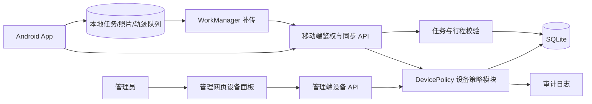
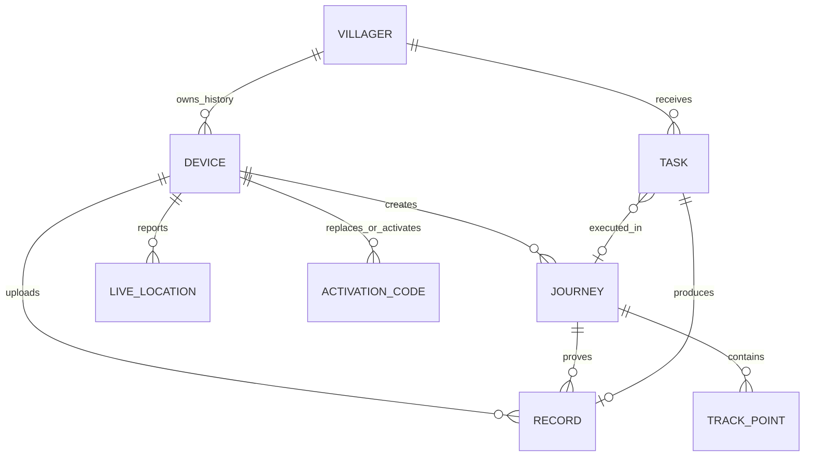
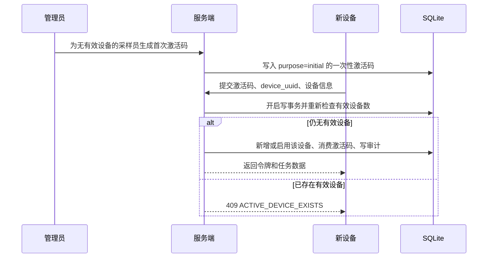
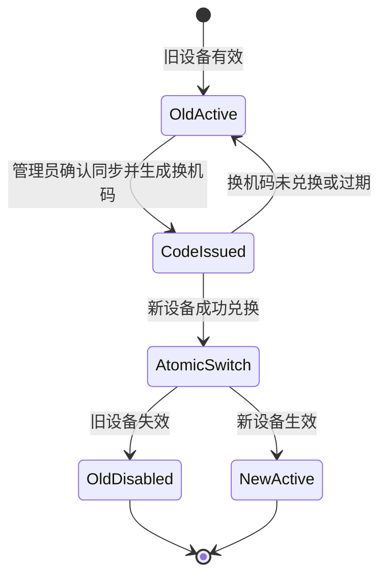
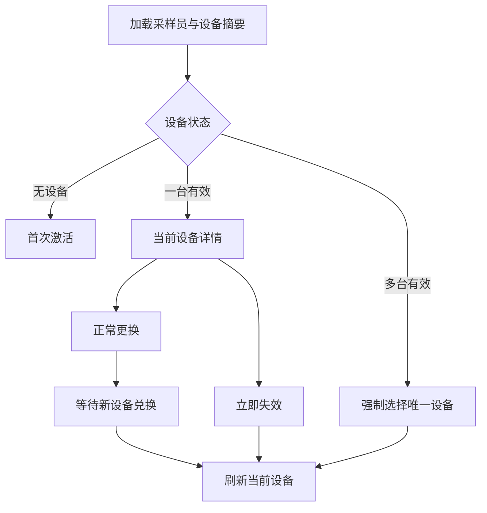

# 单采样员单有效设备治理实施计划

## 1. 文档信息

| 项目 | 内容 |
|---|---|
| 功能名称 | 一个采样员最多一台有效设备 |
| 适用范围 | Node.js 服务器、SQLite 数据库、管理网页、原生 Android App |
| 当前状态 | 待开发 |
| 优先级 | P0，先于进一步的轨迹质量优化上线 |
| 核心原则 | 保留设备历史，但任意时刻每个采样员最多只有一台设备可登录和上传数据 |

## 2. 背景与目标

当前系统允许同一采样员激活多台设备。多台设备同时执行任务时，虽然轨迹点本身按 `journey_id` 和 `device_id` 校验，但任务上的 `journey_id`、`locked_device_id` 和实时位置仍可能被不同设备交替覆盖，带来以下问题：

- 同一采样员在地图上出现相互跳跃、偏移很大的位置和轨迹。
- 同一任务被两台设备分别开始，后启动设备覆盖任务关联的行程。
- 采样记录可能引用任务当前的 `journey_id`，而不是实际拍照设备的行程。
- 实时位置按任务更新，可能被多设备轮流覆盖。
- 设备遗失、换机和停用缺少明确、可审计的管理入口。
- 网络中断时，本地尚未上传的轨迹可能在换机或停用过程中失去补传机会。

本次开发目标是建立并强制执行以下不变量：

> 对任意采样员，数据库允许保留多台历史设备，但 `enabled = 1` 的有效设备数量必须小于等于 1。

完成后，管理员可以查看当前设备、正常更换设备、立即使设备失效，并处理存量的多设备冲突。旧设备的历史任务、照片、轨迹、采样记录和审计数据不得删除或改写。

## 3. 已确认的产品决策

1. 一个采样员可以拥有多条历史设备记录，但同一时间只能有一台有效设备。
2. 首次激活时，如果该采样员没有有效设备，新设备可以直接激活。
3. 已存在有效设备时，普通激活请求不得自动增加第二台有效设备，必须由管理员发起“更换设备”。
4. 正常换机时，生成换机码不会立即停用旧设备；新设备成功兑换换机码的同一事务内，旧设备失效、新设备生效。
5. 正常换机前，管理员应要求旧设备先完成离线照片、记录和轨迹同步。
6. 手机遗失或不可用时，管理员可以“立即失效”。该操作不等待旧设备同步，未离开旧手机的本地数据可能无法恢复，界面必须明确警告。
7. 旧设备失效后，其登录、任务操作、实时位置、轨迹和采样记录上传均立即返回设备失效错误。
8. 历史设备、历史行程、已上传轨迹、照片、记录和审计日志全部保留。
9. 存量多设备冲突由管理员明确指定唯一设备，不按最近登录、最近定位或设备名称自动猜测。
10. 采样员被重新启用时，不得把其所有历史设备重新设为有效。

## 4. 范围

### 4.1 本次必须完成

- 数据库层保证每个采样员最多一台有效设备。
- 服务端集中实现设备激活、更换、失效和存量选择规则。
- 管理网页增加设备列表、唯一设备选择、更换设备和立即失效入口。
- Android 识别设备失效，停止无意义的重复登录和上传重试，同时保留本地待同步数据。
- 修正任务、行程、采样记录之间的设备归属校验。
- 保留断网期间的原始轨迹时间和顺序，联网后补传。
- 增加并发激活、换机、失效、离线补传和历史数据兼容测试。
- 记录完整审计日志。

### 4.2 关联修复

单设备策略能消除多设备互相覆盖，但不能单独解决 GPS 本身不准或地图跨时间间隔直接连线的问题，因此同一版本应包含两项低风险修复：

- 管理网页绘制轨迹时使用服务器输出的分段轨迹 `display.segments`，不再把定位中断前后的点直接连成一条直线。
- Android 定位增加精度、时间连续性和异常速度过滤；GPS 可用时不采用低精度网络定位覆盖轨迹。

### 4.3 不在本次范围

- 删除历史设备及其业务数据。
- 自动合并两台设备已经产生的不同轨迹。
- 根据设备名称判断设备身份。
- 修改 CameraX 拍摄质量策略。
- 改变现有 WGS84 坐标存储标准。

## 5. 技术现状与主要风险点

当前技术栈保持不变，不引入新框架：

- 服务端：Node.js 22+、原生 HTTP 服务、`node:sqlite`。
- 管理网页：原生 HTML、CSS、JavaScript、Leaflet。
- Android：Java 17、CameraX、MapLibre、WorkManager、OkHttp、本地 SQLite。

现有数据关系中：

- `devices` 只有 `(villager_id, device_uuid)` 唯一约束，允许同一采样员多台设备同时 `enabled = 1`。
- 移动端鉴权会校验设备是否启用，因此停用设备可立即使已有令牌失效。
- 任务表只保存一个 `locked_device_id` 和一个 `journey_id`，可能被第二台设备覆盖。
- 轨迹上传会校验行程属于当前设备，这是可继续沿用的安全边界。
- 记录上传当前依赖任务上的 `journey_id`，需改为提交并校验实际行程 ID。
- 管理端启用采样员时当前可能批量启用其所有设备，必须取消该行为。
- App 当前会在 401/403 后尝试静默登录；设备被停用后可能持续失败重试，需要区分“令牌过期”和“设备已失效”。

## 6. 目标架构



设备规则由服务端 `DevicePolicy` 统一负责，路由不得分别实现不同版本的启用和停用逻辑。数据库唯一约束作为最终防线，应用层事务负责返回清晰错误并处理关联状态。

## 7. 数据模型设计

### 7.1 实体关系



### 7.2 `devices` 表调整

保留现有字段，并增加以下审计字段：

| 字段 | 类型 | 说明 |
|---|---|---|
| `disabled_at` | 可空时间 | 设备最后一次失效时间 |
| `disabled_reason` | 可空文本 | `replaced`、`revoked`、`legacy_conflict`、`villager_disabled` 等 |
| `replaced_by_device_id` | 可空整数 | 正常换机后指向新设备 |
| `last_sync_at` | 可空时间 | App 最近一次成功完成同步的时间 |
| `pending_track_count` | 非负整数 | App 最近一次上报的待传轨迹数，仅作换机提示 |
| `pending_record_count` | 非负整数 | App 最近一次上报的待传记录数，仅作换机提示 |

新增部分唯一索引：索引键为 `villager_id`，仅覆盖 `enabled = 1` 的记录。该约束必须确保同一采样员最多一台有效设备。

注意：App 上报的待传数量可能因设备离线而过期，只能用于风险提示，不能证明设备内一定没有未上传数据。

### 7.3 `activation_codes` 表调整

| 字段 | 类型 | 说明 |
|---|---|---|
| `purpose` | 文本 | `initial` 或 `replace` |
| `current_device_id` | 可空整数 | 发起换机时的当前有效设备 |
| `created_by` | 文本 | 操作管理员标识 |

换机码必须绑定采样员和生成时的当前设备。如果兑换时当前有效设备已发生变化，返回冲突错误，要求管理员重新生成，避免旧二维码覆盖后来选定的设备。

### 7.4 数据库不变量

- 每个采样员最多一台 `enabled = 1` 的设备。
- 有效设备必须属于启用状态的采样员。
- 行程、记录和实时位置的 `device_id` 必须与当前请求设备一致。
- 记录携带的 `journey_id` 必须属于当前采样员、当前设备，并与任务点位一致。
- 历史设备失效不会级联删除任何业务数据。
- 设备状态变更必须与审计日志写入处于同一事务。

## 8. 存量数据迁移

由于现有数据库可能已经存在一个采样员多台有效设备，唯一索引不能直接创建。采用两阶段迁移：

### 阶段 A：阻止新增冲突并提供处置入口

1. 备份 SQLite 数据库和上传文件。
2. 增加设备审计字段及激活码用途字段。
3. 上线应用层单设备检查，阻止产生新的多设备冲突。
4. 管理端显示“待处理设备冲突”列表。
5. 对每个冲突采样员，由管理员按不可变 `device_id` 或完整设备 UUID 选择唯一设备。
6. 事务内启用选定设备、停用其他设备、处理中断行程与任务锁并写审计。

### 阶段 B：建立数据库强约束

1. 检查每个采样员的有效设备数量均不超过 1。
2. 创建仅约束有效设备的部分唯一索引。
3. 再次执行一致性检查。
4. 运行服务器 API、迁移和 Android 同步回归测试。

不得通过“最近上线”“最近激活”或数组第一条自动选择唯一设备。对“采样员01”等现有冲突，必须由管理员明确指定目标 `device_id`。

## 9. 核心业务流程

### 9.1 首次激活



### 9.2 正常更换设备



具体规则：

1. 换机弹窗展示旧设备最近同步时间和最近上报的待传数量。
2. 管理员确认旧设备已完成同步后生成换机码。
3. 生成换机码不改变旧设备状态，避免二维码未使用时造成业务中断。
4. 新设备兑换时开启数据库写事务。
5. 校验换机码未过期、未使用，且当前有效设备仍是生成时绑定的旧设备。
6. 停用该采样员全部历史设备，再启用或新增新设备。
7. 消费换机码、写入替换关系和审计日志。
8. 对旧设备仍处于活动状态的行程标记为中断并结束；未产生记录的任务释放旧设备锁，已完成记录保持不变。
9. 提交事务后向新设备返回令牌。

### 9.3 立即失效

适用于设备遗失、被盗或无法开机：

1. 管理员二次确认，界面明确提示“旧设备尚未上传的数据可能无法恢复”。
2. 事务内将设备设为无效并记录原因。
3. 结束并标记该设备的活动行程为中断。
4. 对尚无采样记录的任务释放该设备锁和失效的行程引用，使唯一新设备可以重新执行。
5. 已上传的记录、照片、轨迹和已完成任务不变。
6. 旧令牌下一次请求立即收到 `403 DEVICE_REVOKED`。

### 9.4 存量冲突选择

管理员在设备列表中选择一台作为当前唯一设备。提交后：

- 服务端验证所选设备属于该采样员。
- 事务内停用其他有效设备，选中设备保持或恢复有效。
- 其他设备的活动行程标记中断。
- 释放其他设备持有且尚未形成采样记录的任务锁。
- 保存操作者、采样员、选中设备、被停用设备及原因到审计日志。

## 10. 服务端模块设计

新增 `bsc-sampling-v1/src/device-policy.js`，由其独占以下写操作：

- 查询采样员设备历史和当前设备。
- 判断是否允许生成首次激活码或换机码。
- 兑换激活码并执行原子切换。
- 立即使设备失效。
- 选择存量冲突中的唯一设备。
- 处理中断行程、任务锁和设备替换关系。
- 写入设备状态审计。

路由层只负责鉴权、请求解析、调用策略模块和格式化响应。`server.js` 内不得继续出现绕过策略模块的批量设备启用逻辑。

### 10.1 关键事务伪代码

```text
BEGIN IMMEDIATE
  validate activation code and expected current device
  validate villager is enabled
  disable every device owned by villager
  enable or insert the incoming device
  interrupt unfinished journeys from replaced devices
  release task locks that have no completed record
  consume activation code
  write audit event
  assert enabled device count <= 1
COMMIT
```

任何步骤失败都必须回滚，不能出现旧设备已停用但新设备未生效的中间状态。

## 11. API 设计

### 11.1 管理端 API

#### 获取采样员设备列表

- 方法与路径：`GET /api/v1/admin/villagers/:villagerId/devices`
- 权限：管理员会话。
- 返回：采样员状态、当前有效设备、历史设备数组、是否存在冲突、活动行程和最近同步摘要。
- 设备 UUID 在普通列表中仅显示末 8 位；确认操作可使用不可变数字 `deviceId`。

#### 生成激活码

- 方法与路径：沿用 `POST /api/v1/admin/villagers/:villagerId/activation`
- 请求字段：

| 字段 | 必填 | 说明 |
|---|---:|---|
| `mode` | 是 | `initial` 或 `replace` |
| `currentDeviceId` | 换机时是 | 管理员看到的当前有效设备 ID，用于防止并发覆盖 |

- 首次激活时若已有有效设备，返回 `409 ACTIVE_DEVICE_EXISTS`。
- 换机时若当前设备不匹配，返回 `409 ACTIVE_DEVICE_CHANGED`。
- 返回二维码内容、有效期、模式和被替换设备摘要。

#### 选择唯一设备

- 方法与路径：`POST /api/v1/admin/villagers/:villagerId/devices/:deviceId/select`
- 用途：只用于存量冲突处置或管理员明确恢复某台历史设备。
- 请求字段：确认文本和操作原因。
- 返回：新当前设备、被停用设备列表、释放的任务数和中断行程数。

#### 立即失效

- 方法与路径：`POST /api/v1/admin/devices/:deviceId/revoke`
- 请求字段：原因和确认标志。
- 若目标已失效，返回幂等成功结果。
- 不提供删除设备接口。

#### 修改设备名称

- 方法与路径：`PATCH /api/v1/admin/devices/:deviceId`
- 仅允许更新便于识别的设备名称，不允许通过此接口修改 `villager_id` 或 `enabled`。

### 11.2 移动端 API

#### 兑换激活码

- 方法与路径：沿用 `POST /api/v1/mobile/activate`。
- 首次激活和换机由激活码自身的 `purpose` 决定，App 不可自行声明换机权限。
- 成功响应返回当前设备 ID、采样员信息和访问令牌。

#### 上报同步状态

- 方法与路径：`POST /api/v1/mobile/device-status`。
- 字段：本地待传轨迹数、待传记录数、最近一次成功同步时间、App 版本。
- 用途：管理网页换机前提示，不作为强一致性证明。

#### 统一设备失效响应

所有移动端受保护接口统一返回：

| HTTP | 错误码 | App 行为 |
|---:|---|---|
| 401 | `TOKEN_EXPIRED` | 允许尝试一次静默登录 |
| 403 | `DEVICE_REVOKED` | 停止重试，保留本地数据并进入设备失效页 |
| 403 | `VILLAGER_DISABLED` | 停止业务同步，提示联系管理员 |
| 409 | `DEVICE_CONFLICT` | 停止本次操作，重新拉取设备状态 |

## 12. 管理网页设计

采样员列表增加“设备”入口，并展示当前状态：

- 未激活：灰色“无有效设备”。
- 正常：绿色“1 台有效设备”，显示设备名称、UUID 末 8 位和最后在线时间。
- 存量冲突：红色“多台有效设备，需处理”，阻止继续生成普通激活码。
- 已停用采样员：设备信息保留，但所有设备均不可用。

设备抽屉或弹窗包含：

1. 当前设备卡片：设备名称、设备 ID、UUID 末 8 位、Android/App 版本、激活时间、最后在线、最后同步、最近待传数量。
2. 操作按钮：修改名称、更换设备、立即失效。
3. 历史设备列表：失效时间、原因、替换设备和历史状态，只读展示。
4. 存量冲突处置：每台设备单选，管理员选择“设为唯一设备”。

交互约束：

- 原文“同一采样员可绑定多台设备”改为“同一采样员同一时间只能使用一台设备”。
- 更换设备前展示同步风险确认，但生成二维码时不立即停用旧设备。
- 立即失效使用危险操作样式并二次确认。
- 采样员重新启用后，如果没有有效设备，引导生成首次激活码，不能自动恢复所有历史设备。

前端状态流：



## 13. Android App 设计

### 13.1 设备失效状态

App 增加明确的授权状态：`ACTIVE`、`TOKEN_EXPIRED`、`DEVICE_REVOKED`、`VILLAGER_DISABLED`。

收到 `DEVICE_REVOKED` 后：

- 清除访问令牌，不清除设备 UUID。
- 停止静默登录循环、实时位置上传和 WorkManager 网络重试。
- 停止新任务和新采样操作。
- 保留本地数据库、照片、水印照片和待传轨迹，不做自动删除。
- 显示“本设备已失效，请联系管理员重新激活”。
- 提供查看本地待传数量和导出诊断信息的入口。

若管理员恢复的正是同一物理设备，用户重新扫码后允许继续同步仍属于该设备的本地队列；服务端仍需逐条校验任务和行程归属。

### 13.2 离线轨迹补传

- 定位产生后先写本地数据库，再尝试网络上传。
- 每个点保存原始 `recordedAt`、单调递增 `sequence`、经纬度、精度、速度、定位来源和 mock 标记。
- 断网期间继续采集，不等待天气、反向地理编码或其他网络信息。
- 恢复联网后按行程和 `sequence` 分批上传，沿用每批最多 1000 点。
- 服务端确认成功后才标记对应点已上传；部分失败只重试未确认部分。
- 上传顺序为：确认行程存在 → 补传轨迹 → 上传采样记录和照片 → 完成行程。
- 补传不得使用“当前时间”替换原始采集时间。

### 13.3 定位质量关联修复

- GPS 定位可用时，以 GPS 为主。
- 网络定位只在 GPS 暂不可用且精度达到可接受阈值时作为降级数据。
- 明显超出精度阈值、产生不合理速度或时间倒退的点不进入展示轨迹，但原始诊断数据可保留。
- 轨迹中断超过约定阈值时形成新分段，不跨中断区间画直线。

具体阈值沿用并扩展现有轨迹平滑测试确定，不能只依赖“单设备”假设。

## 14. 任务、行程与记录一致性

### 14.1 开始任务

- 只有当前有效设备可开始任务。
- 已被其他历史设备锁定但尚无采样记录的任务，在设备替换/失效事务中释放。
- 服务端创建或复用行程后，必须同时写入任务的 `locked_device_id` 和 `journey_id`。
- 复用行程必须同时匹配采样员、当前设备和点位。

### 14.2 上传采样记录

Android 请求必须显式提交实际拍摄流程所使用的 `journeyId`。服务端依次验证：

1. 当前令牌设备仍是采样员唯一有效设备。
2. 行程属于当前采样员和当前设备。
3. 行程点位与任务点位一致。
4. 任务锁属于当前设备，或满足受控的离线补传兼容规则。
5. `client_record_id` 幂等规则仍成立。

记录写入必须使用已验证的请求行程，不再盲目采用任务当前可变的 `journey_id`。

### 14.3 实时位置

- 上报实时位置时校验任务锁属于当前设备。
- 设备失效后禁止继续覆盖 `live_locations`。
- 管理端按当前设备和时间新鲜度展示实时位置，过期位置明确标记，不伪装为在线。

## 15. 轨迹展示修复

管理网页的轨迹概览和详情统一使用服务器生成的分段结果：

- 每个 `segment` 单独创建折线。
- 不允许直接对所有原始点创建单条折线。
- 同一行程 ID 去重后再加载。
- 大时间间隔、异常跳点和被过滤的低质量点之间不连线。
- 原始轨迹仍用于审计和导出，展示层过滤不得删除数据库数据。

## 16. 安全与审计

- 激活码一次性、限时、绑定采样员和操作用途。
- 换机码额外绑定生成时的当前设备，防止陈旧二维码覆盖新状态。
- 激活、换机、失效、恢复、改名和存量选择均写审计日志。
- 审计内容至少包括管理员、采样员、旧设备、新设备、原因、时间、受影响任务数和行程数。
- 设备 UUID 默认脱敏显示，日志不得记录访问令牌或完整激活码。
- 激活和登录继续受速率限制。
- 设备失效依靠每次移动端请求的数据库状态校验立即生效，不只依赖令牌过期。
- 并发兑换使用 SQLite 写事务和数据库唯一索引保证最多一个成功。

## 17. 性能与可扩展性

- 当前规模小于等于 10 名采样员，SQLite 足以满足需求。
- 设备列表按 `villager_id` 查询并使用现有外键索引或补充普通索引。
- 当前设备摘要可并入管理端 bootstrap，详细历史按需加载，避免首页载入全部行程。
- 轨迹仍按批次上传，单次请求上限保持 1000 点，避免断网后一次提交过大。
- `last_seen_at` 更新应限频，例如每台设备每分钟最多落库一次，避免每个 API 请求都写数据库。
- 不增加 Docker、消息队列或新数据库依赖。

## 18. 测试计划

### 18.1 数据库与迁移测试

- 无重复设备的旧库可平滑升级。
- 存在多台有效设备时，阶段 A 不丢数据并准确列出冲突。
- 冲突未处理前不能创建强约束；处理后可成功创建。
- 唯一索引拒绝同一采样员第二台有效设备。
- 历史设备和关联记录在停用后仍可查询。

### 18.2 服务端单元与 API 测试

- 无当前设备时首次激活成功。
- 已有当前设备时首次激活返回 409。
- 生成换机码后旧设备仍可工作。
- 新机兑换后，旧设备失效且新设备成为唯一有效设备。
- 过期、已用、用途错误和绑定设备已变化的激活码被拒绝。
- 两台新设备并发兑换时只能一台成功。
- 旧设备携带未过期令牌访问任意移动接口仍返回 `DEVICE_REVOKED`。
- 立即失效为幂等操作。
- 重新启用采样员不会启用全部历史设备。
- 存量选择保留历史数据、结束旧活动行程并释放无记录任务锁。
- 记录上传使用并校验请求中的 `journeyId`。
- 不同设备或不同点位的行程 ID 被拒绝。

### 18.3 Android 测试

- 令牌过期只静默登录一次，成功后恢复同步。
- 设备失效后停止重试且保留本地数据库和照片。
- 断网期间持续保存轨迹原始时间和顺序。
- 重连后按序补传，服务器确认后才删除或标记已传。
- App 被杀死并重启后仍能恢复待传任务。
- 正常换机前能够展示本地待传数量。
- GPS 和网络定位同时回调时不会被低精度网络点拉偏。

### 18.4 网页端测试

- 无设备、单设备和多设备冲突状态显示正确。
- 管理员可按设备 ID 明确选择唯一设备。
- 换机二维码流程不会在兑换前停用旧机。
- 立即失效确认文案和结果正确。
- 历史设备只读展示，不提供删除入口。
- 轨迹跨时间间隔显示为多个分段，不出现人为长直线。

### 18.5 回归命令

服务器至少执行：

```text
npm run check
npm test
npm run smoke
npm run test:e2e
```

Android 至少执行单元测试和 debug 构建，并补充两台真机的换机、断网、重连和旧机失效验证。

## 19. 验收标准

以下条件全部满足才可验收：

- 数据库查询结果中不存在任一采样员拥有两台有效设备。
- 服务端和数据库两层都能阻止并发产生第二台有效设备。
- 正常换机在新机兑换成功前不影响旧机，成功后状态一次性切换。
- 旧设备已有令牌立即失效，无法继续上传位置、轨迹、照片或记录。
- 管理员可以指定“采样员01”的唯一设备，且其他设备历史数据完整保留。
- 设备失效或换机不会修改已完成的采样记录。
- 断网期间的轨迹按原始时间补传，不以重连时间替代。
- 管理网页不跨轨迹中断区间绘制直线。
- Android 遇到设备失效不持续停留在重试状态，也不删除本地未传证据。
- 采样员重新启用不会把多台历史设备同时恢复为有效。
- 全量自动化测试通过，并完成至少一次两台真机的人工并发验证。

## 20. 开发顺序与文件影响

### 第一阶段：服务端基础

- `bsc-sampling-v1/src/schema.js`：新增字段、迁移检查、冲突报告和最终唯一索引。
- `bsc-sampling-v1/src/device-policy.js`：新增集中设备策略与事务。
- `bsc-sampling-v1/src/server.js`：调整激活、登录、采样员启停、任务、记录和设备管理 API。
- `bsc-sampling-v1/test/schema.test.js`：迁移和唯一性测试。
- `bsc-sampling-v1/test/api.test.js`：激活、换机、失效、并发与行程归属测试。

### 第二阶段：管理网页

- `bsc-sampling-v1/public/index.html`：设备面板、换机和失效弹窗。
- `bsc-sampling-v1/public/app.js`：设备状态加载、操作流程、冲突选择和分段轨迹绘制。
- 对应样式文件：补充紧凑设备卡片和风险状态样式。
- `bsc-sampling-v1/test/frontend.e2e.js`：设备管理与轨迹分段端到端测试。

### 第三阶段：Android

- 网络层：解析结构化设备失效错误。
- `Prefs.java`：保存明确授权状态，不再仅凭本地用户名判断已激活。
- `SyncEngine.java`：区分令牌过期和设备失效，停止无意义重试，上报待传队列摘要。
- 轨迹服务与本地数据库：保证原始时间、序号和定位来源持久化，补充定位质量过滤。
- 任务/记录上传模型：提交实际 `journeyId`。
- UI：增加设备失效页和本地待传数量提示。

### 第四阶段：迁移和发布

- 在生产备份上演练迁移。
- 上线阶段 A，处理所有存量冲突。
- 为“采样员01”等冲突账户人工选定唯一设备。
- 确认冲突数量为 0 后创建数据库唯一索引。
- 发布服务端和网页，再发布 Android App。
- 执行真机换机和断网补传验收。

## 21. 发布、监控与回滚

### 21.1 发布前

- 使用 SQLite 一致性快照备份数据库。
- 备份上传照片、参考图和配置。
- 输出存量冲突采样员及设备清单，由管理员确认选择结果。
- 记录发布前有效设备、活动行程、被锁任务和待审核记录数量。

### 21.2 上线监控

重点监控：

- 每个采样员有效设备数大于 1 的违规数量，目标恒为 0。
- `DEVICE_REVOKED`、激活 409 和换机码失败次数。
- 被中断行程和释放任务锁数量。
- 设备最后在线、最后同步及待传队列摘要。
- 轨迹批次重试、序号冲突和记录行程校验失败。

### 21.3 回滚原则

- 应用版本可回滚，但不得自动重新启用已停用设备。
- 唯一索引只有在确认旧版本不会批量启用设备后才能保留；若必须撤销索引，也仍应保留当前设备选择结果。
- 不通过回滚删除迁移后新增的审计字段或历史记录。
- 若换机事务失败，数据库回滚后旧设备应继续有效，新设备不得获得有效令牌。

## 22. 主要风险与缓解

| 风险 | 影响 | 缓解措施 |
|---|---|---|
| 旧设备还有未传数据就被立即失效 | 本地证据无法从服务器恢复 | 正常换机先同步；立即失效强提醒；保留旧机本地数据 |
| 存量重复设备导致索引创建失败 | 服务无法启动或迁移中断 | 两阶段迁移，先人工选择再建索引 |
| 两个换机码并发兑换 | 产生第二台有效设备或选错设备 | 激活码绑定当前设备、写事务、部分唯一索引 |
| 采样员启停逻辑批量恢复历史设备 | 重新制造冲突 | 启用采样员与启用设备完全分离 |
| 任务上的行程被覆盖 | 记录归属错误 | 请求显式提交 `journeyId` 并按设备、采样员、点位校验 |
| 单设备上线后轨迹仍有偏移 | 用户误以为方案无效 | 同版加入定位质量过滤和分段绘制修复 |
| 设备待传数量不是实时值 | 管理员误判同步完成 | 标明“最近上报”，正常换机仍需人工确认旧机已同步 |

## 23. 服务端 Agent 执行口径

向服务端 Agent 下达任务时，应使用以下不可变要求：

1. 对指定采样员，管理员通过不可变 `device_id` 或完整设备 UUID 选择唯一设备。
2. 同一事务中把选中设备设为有效、其他设备设为无效；完成存量清理后建立数据库唯一约束。
3. 不删除任何旧设备、行程、轨迹点、照片、采样记录或审计数据。
4. 旧设备令牌必须立即失效。
5. 旧设备活动行程标记为中断；仅释放尚未形成采样记录的任务锁。
6. 记录和轨迹必须显式绑定并校验实际设备的行程，不能只信任任务当前的 `journey_id`。
7. 已存在有效设备时，普通激活必须拒绝；只有管理员发起的换机码可在新机兑换时原子替换。
8. 重新启用采样员不得批量启用其历史设备。
9. 所有设备状态变更必须记录审计并提供自动化测试。
10. 实施前备份数据库，实施后验证每个采样员有效设备数均小于等于 1。

## 24. 完成定义

代码、数据库迁移、网页交互、Android 状态处理和自动化测试全部完成后，分别提交清晰的 Git 提交；最终合并版本必须包含：

- 单设备数据库约束和存量数据处置。
- 服务端设备策略和安全校验。
- 管理网页设备管理能力。
- Android 设备失效与离线补传保护。
- 任务/行程/记录归属修复。
- 轨迹分段显示和定位质量关联修复。
- 本文档、测试记录和发布说明。
