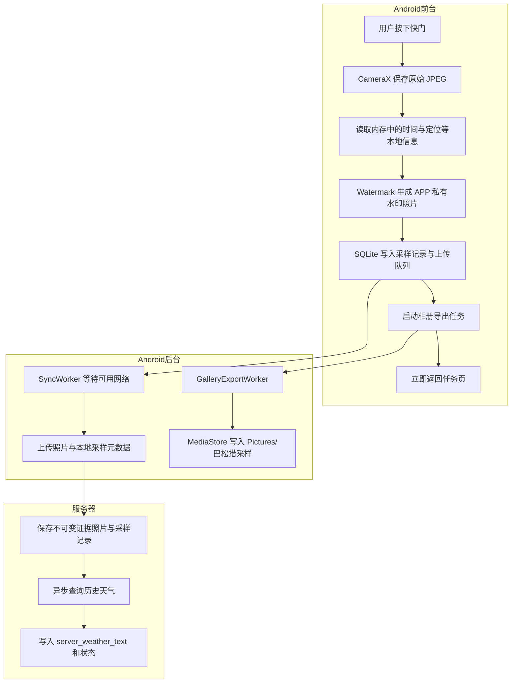

# 安卓端离线优先拍照与水印相册保存实施方案

## 1. 目标

将采样照片流程改为“本地拍照立即完成、网络信息后台补充”。用户按下快门后，APP 只读取已经存在于手机内存或本地存储中的信息，生成带水印照片、保存采样记录并尽快返回任务界面；任何天气查询、照片上传和服务器同步都不得阻塞拍照流程。

带水印照片除保存在 APP 私有目录供可靠上传外，还要自动复制一份到系统相册，便于用户在手机相册中查看和备份。CameraX 当前的 `CAPTURE_MODE_MAXIMIZE_QUALITY` 和 JPEG 95 配置保持不变。

## 2. 已确认需求

- 保留 CameraX 最高质量拍摄模式和 JPEG 95 原始输出质量。
- 拍照及生成水印期间不调用天气接口、服务器接口或任何第三方网络服务。
- 水印仅使用本地可得信息：项目、样品编号、样品类型、点位名称、历史序号、采样员、拍摄时间、经纬度、距点距离和定位精度。
- 天气不再写入证据照片水印；由服务器在记录上传后异步获取，并作为记录元数据显示。
- 水印文件生成成功后立即保存本地采样记录，不再停留 10 秒等待自动保存。
- 记录落盘后立刻返回任务页，允许用户继续操作其他采样任务。
- 带水印照片自动复制到系统相册 `Pictures/巴松措采样`。
- 弱网、无网、天气服务不可用或相册导出失败，都不能导致采样记录或 APP 私有目录中的原始证据丢失。

## 3. 不在本次范围内

- 不降低 CameraX 拍摄质量，不修改对焦、相机方向或分辨率策略。
- 不修改二维码校验、300 米硬限制、异常无水流程、轨迹记录和照片防重复审核规则。
- 不由服务器重写已经上传的证据照片。服务器天气只作为独立元数据保存，避免改变图片哈希和审核原件。
- 不要求用户手动授予传统外部存储权限；项目最低版本为 Android 10，应使用 MediaStore 分区存储。

## 4. 当前问题

当前 `PhotoActivity.shoot()` 在 CameraX 返回 JPEG 后，会依次执行：

1. 检查手机是否具有网络能力。
2. 手机直接访问 Open-Meteo 获取天气。
3. 等天气请求成功或超时。
4. 生成水印文件。
5. 返回 `TaskActivity`。
6. 再等待 10 秒自动保存记录。

`NetworkCapabilities.NET_CAPABILITY_INTERNET` 只表示网络声称可访问互联网，不代表链路已经验证可用。山谷弱网、有蜂窝信号但无数据、Wi-Fi 无外网等场景仍会进入请求，现有 HTTP 读取超时可达到 35 秒，因此用户会长时间停留在“已拍摄，处理中”。

另外，`SyncEngine` 在后台上传前还会再次由手机查询天气。这不会直接阻塞前台页面，但会延迟照片上传，且与服务器已有的天气回填职责重复。

## 5. 目标架构



关键边界：`A → G` 路径中不得出现 DNS、HTTP、服务器登录、天气查询或网络可用性等待。

## 6. 详细实现

### 6.1 `PhotoActivity`：纯本地拍照

目标文件：`bsc-android-native/app/src/main/java/online/gpsgps/bscsampling/PhotoActivity.java`

- 删除 `Util.online()` 和 `Api.weather()` 调用。
- 保持以下 CameraX 配置不变：
  - `ImageCapture.CAPTURE_MODE_MAXIMIZE_QUALITY`
  - `setJpegQuality(95)`
- CameraX 保存成功后立即记录本机时间，并使用 Intent 中已有的定位、精度和距离生成水印。
- 水印第四行只显示拍摄时间，不再拼接手机天气结果。
- `WEATHER` 返回值统一为 `待服务器补充`，仅用于兼容现有字段；后续可在协议升级时移除该常量。
- 水印成功后立即通过 Activity Result 返回 APP 私有文件路径，不进行上传或相册写入。

建议水印内容：

```text
项目　样品编号　样品类型
点位名称（历史序号）　采样员
WGS84 经纬度　距点距离　定位精度
拍摄时间
```

### 6.2 `TaskActivity`：立即落盘并返回

目标文件：`bsc-android-native/app/src/main/java/online/gpsgps/bscsampling/TaskActivity.java`

- `photoResult()` 收到有效水印文件后，不再启动 10 秒倒计时。
- 立即执行现有本地保存逻辑：创建/关联行程、写入 SQLite `records`、将任务标记为本地已采样，并提交后台同步任务。
- `Store.record()` 写入 SQLite 后立即以返回的 `clientRecordId` 提交相册导出任务，作为相册导出的幂等键。
- 记录可靠写入 SQLite 后，TaskActivity 提交上传任务并立即 `finish()` 返回任务页。
- 本地记录写入失败时不得退出页面，继续显示明确错误并保留照片路径，允许用户重试。
- 相册导出失败不回滚采样记录；通过诊断日志记录失败，后续后台重试。

### 6.3 系统相册导出

建议新增：

- `GalleryExportWorker.java`：执行相册写入。
- `GalleryStore.java`：封装 MediaStore 查询、插入、复制和清理逻辑，便于单元测试。

相册规则：

- 使用 Android 10+ MediaStore，不申请 `WRITE_EXTERNAL_STORAGE`。
- `RELATIVE_PATH`：`Pictures/巴松措采样`
- `MIME_TYPE`：`image/jpeg`
- 文件名：`BSC-{样品编号}-{clientRecordId前8位}.jpg`；记录 ID 保证同一条记录重试时文件名稳定且不重复。
- 写入时先设置 `IS_PENDING=1`，完整复制并关闭输出流后更新为 `IS_PENDING=0`。
- 写入失败时删除未完成的 MediaStore 条目，避免相册出现损坏文件。
- 任务使用 `clientRecordId` 创建唯一 WorkManager 名称，并采用 `ExistingWorkPolicy.KEEP`，避免重复调度。
- Worker 写入前按目标文件名查询相册；文件已存在则直接成功，保证重试不会生成多张重复照片。
- Worker 不设置网络约束，最多重试 3 次；最终失败时保留 APP 私有照片和上传队列，并写诊断日志。

伪代码：

```text
recordId = store.record(taskId, journeyId, privatePhotoPath, payload)
enqueueUniqueWork("gallery-" + recordId, KEEP, GalleryExportWorker(privatePhotoPath, displayName))
enqueueUploadWork(networkRequired = true)
returnToTaskList()
```

### 6.4 `SyncEngine`：取消手机天气请求

目标文件：`bsc-android-native/app/src/main/java/online/gpsgps/bscsampling/SyncEngine.java`

- 删除上传前的 `Api.weather()` 调用。
- 上传记录时直接携带本地 `weatherText=待服务器补充`。
- 保留照片 Base64 编码、离线行程补报、失败重试和上传成功状态更新。
- 手机只负责提交可验证的本地事实，不负责访问第三方天气服务。

### 6.5 服务器天气回填

目标文件：

- `bsc-sampling-v1/src/server.js`
- `bsc-sampling-v1/src/weather.js`

现有服务器已经在记录写入后异步执行 `backfillRecordWeather()`，本次以验证和补充测试为主：

- 上传接口先完成照片和记录持久化，再立即响应手机。
- 天气查询不得被 `await` 到上传响应链路中。
- 查询成功写入 `server_weather_text` 和 `server_weather_status=complete`。
- 超时或失败写入 `server_weather_status=unavailable`，不改变上传成功状态。
- 原始 `weather_text` 和照片文件保持不变。

## 7. 数据与接口影响

- 服务器数据库已有 `server_weather_text`、`server_weather_status` 字段，不需要新增迁移。
- 移动上传接口结构保持兼容，`weatherText` 继续传字符串 `待服务器补充`。
- 相册幂等性使用现有 `client_record_id`，无需修改服务器接口。
- APP 本地数据库无需新增字段；相册导出状态通过唯一 WorkManager 和 MediaStore 文件名控制。如果未来需要在“我的”页面显示相册导出状态，再单独增加本地字段。

## 8. 失败与恢复策略

| 场景 | 预期行为 |
| --- | --- |
| 完全离线拍照 | 正常生成水印、写入本地记录、返回任务页、等待联网上传 |
| 弱网或有信号但无外网 | 拍照路径不检测网络，行为与完全离线一致 |
| 本地水印生成失败 | 留在拍照页，提示重新拍照，不创建记录 |
| SQLite 记录失败 | 留在任务页并提示重试，不删除私有照片 |
| 相册写入失败 | 采样记录仍成功；后台最多重试 3 次并记录日志 |
| 上传失败 | WorkManager 保留记录并等待下次联网重试 |
| 服务器天气失败 | 记录和照片仍上传成功，天气状态显示“暂不可用” |
| APP 在相册复制中退出 | WorkManager 之后继续；按文件名检查避免重复图片 |

## 9. 安全与证据完整性

- APP 私有水印照片是上传源文件，不能因为相册导出失败而删除。
- 相册文件是方便用户查看的副本，不作为上传唯一来源。
- 服务器只附加天气元数据，不重编码、不覆盖证据照片。
- 保留拍摄时间、位置、精度、距点距离及 EXIF 校验机制。
- 日志不得记录照片 Base64、激活令牌或完整授权头。

## 10. 测试方案

### 10.1 Android 自动测试

- 静态/单元测试确认 `PhotoActivity` 拍照完成路径不再调用 `Api.weather()` 或其他 HTTP 方法。
- 静态/单元测试确认 `SyncEngine` 上传前不再调用手机天气接口。
- 水印测试确认第四行只有本地拍摄时间，不包含等待网络得到的天气。
- `photoResult()` 测试确认不创建 10 秒延迟任务，并立即写入本地记录。
- MediaStore 封装测试覆盖：首次写入、相同记录重复执行不重复、失败清理半成品、文件已存在直接成功。
- WorkManager 测试覆盖无网络约束和唯一任务名称。

### 10.2 服务器自动测试

- 上传响应不等待天气服务完成。
- 天气成功时只更新服务器天气字段。
- 天气超时/失败时记录仍保持上传成功。
- 天气回填不改变照片哈希和客户端天气原值。

### 10.3 真机验收

1. 开启飞行模式完成一次正常采样，拍照后能够自动保存并返回任务页。
2. 模拟只有信号但无法访问互联网，确认拍照耗时与飞行模式基本一致。
3. 在系统相册 `巴松措采样` 中确认出现一张带完整水印的照片。
4. 强制关闭并重启 APP，确认待上传记录和 APP 私有照片仍存在。
5. 恢复网络后确认照片自动上传，服务器随后补充天气信息。
6. 重复触发相册 Worker，确认相册中不会产生重复照片。
7. 检查另一采样任务可立即打开并操作，不受上一张照片上传或天气查询影响。

## 11. 验收标准

- 拍照关键路径中不存在任何网络请求。
- 离线与弱网环境下，CameraX 回调完成后只经过本地水印和数据库写入即可返回任务页。
- 不再出现 10 秒自动保存倒计时。
- 每条成功落盘的采样记录最终在系统相册中恰好生成一张带水印副本。
- 相册失败、上传失败和天气失败互不影响采样记录的本地可靠保存。
- 用户可以在照片保存后立即继续查看地图或处理下一项任务。
- CameraX 最高质量模式和 JPEG 95 保持不变。

## 12. 实施结果

- 已完成 Android 拍照页、即时本地落盘、手机天气请求移除、MediaStore 相册导出和 WorkManager 幂等重试。
- 已完成 `GalleryStore` 文件名与幂等规则单元测试。
- Android `testDebugUnitTest assembleDebug` 通过；服务端全量 62 项测试通过。

## 13. 推荐实施顺序

1. 先增加能够捕获拍照链路网络调用和 10 秒延迟的回归测试。
2. 移除 `PhotoActivity` 与 `SyncEngine` 中的手机天气请求。
3. 将 `TaskActivity` 改为记录落盘后立即返回。
4. 实现 MediaStore 相册导出及幂等 WorkManager。
5. 补充服务器异步天气回填测试。
6. 运行服务端全量测试、Android 单元测试和 Debug APK 构建。
7. 使用飞行模式、弱网和真机相册完成手工验收。
