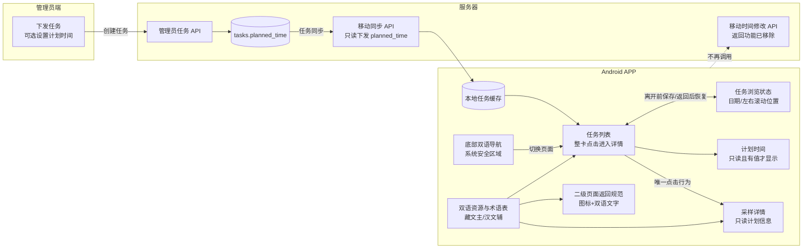
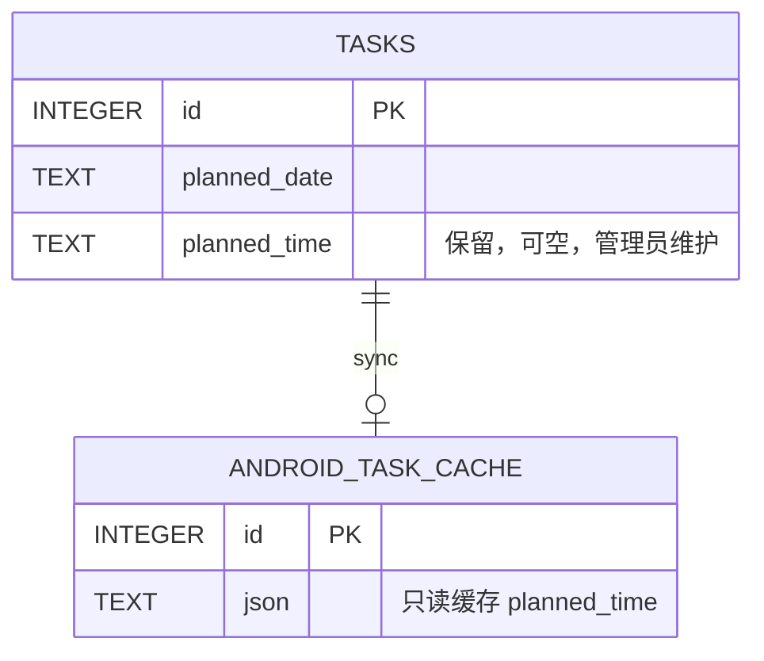
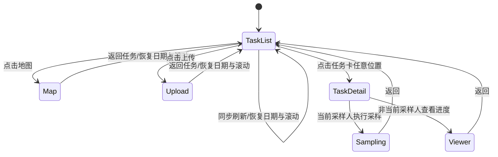

# APP 任务列表、导航与藏文优先交互优化开发文档

## 1. Goal

删除 Android APP 任务列表中点击“计划时间未设置/计划 HH:mm”弹出时间选择器的功能，使任务卡的点击行为唯一且明确：进入采样任务详情。任务页在切换到地图、上传、我的页面或同步刷新后，必须恢复用户原先选择的日期及左右列表滚动位置，避免现场反复查找采样点。底部导航需要完整显示图标、藏文主行和汉文辅行，并避开 Android 系统手势区域。所有现场操作界面进一步提高藏文占比，统一采用“图形符号＋藏文主文＋汉文辅文”，所有非首页层级提供可见的双语返回按钮。任务详情页彻底删除独立的“风险提醒”卡片，但保留距离超限等真正参与采样判定的安全规则。本次调整不改变计划日期、任务编号、双人协作、接管、采样、上传及历史数据。

## 2. 背景与问题

当前任务卡内的时间文字 `TextView` 单独注册了点击事件，点击该区域会调用 `editPlannedTime()` 并弹出系统 `TimePickerDialog`；任务卡其他区域则进入 `TaskActivity`。时间文字没有按钮外观，采样员无法预判这一区域具有编辑功能，容易把“点击采样点”误操作成“设置时间”。

该功能还允许采样员在手机端改写管理员下发的计划时间，并通过离线队列稍后同步，不符合任务安排由管理员统一维护、采样员专注执行的使用场景。

任务页面当前由 `showTasks()` 每次动态重建。切换底部页面时，原任务 View 被 `content.removeAllViews()` 删除；再次进入任务页或同步完成后，代码重新选择最新日期并把两个 `ScrollView` 恢复到顶部，因此用户刚找到的采样点位置会丢失。

底部导航栏当前固定为 `76dp`，每项同时容纳 26dp 图标、藏文和汉文两行文字。应用以 Android 15（targetSdk 35）为目标时，系统底部手势安全区域还会占用可用空间；现有布局没有处理底部 Window Insets，导致汉语行被挤压或遮挡。

## 3. Requirements

### 3.1 APP 交互

- 点击任务卡任意可见区域，包括样本图标、点位名称、样本编号、计划时间、人员状态和右箭头，统一进入该任务的采样详情页。
- 删除任务列表中的时间选择器及所有隐式时间编辑点击区域。
- 管理员设置了 `planned_time` 时，任务卡只读显示“计划 HH:mm”。
- `planned_time` 为空时，只显示“样本类型 · 样本编号”，不显示“计划时间未设置”。
- 任务详情页继续只读显示管理员下发的计划日期和可选时间，不增加 APP 端编辑入口。
- 藏文主行、汉文辅行、任务列表左侧日期结构及现有视觉布局保持不变。

### 3.2 权限与数据归属

- 主采样人和备用采样人均不能在 APP 中修改计划时间。
- 管理员端现有的任务下发时间字段继续保留；服务器数据库中的 `tasks.planned_time` 继续保留。
- 已存在的计划时间和历史审计记录不得删除或重写。
- 计划日期、采样人、采样权版本、二维码和样品编号逻辑不受影响。

### 3.3 旧版本兼容

- 新版 APP 不再产生本地计划时间修改或同步请求。
- APP 本地数据库升级时删除旧的 `task_schedules` 待同步队列，防止升级前误设的时间在以后重新上传。
- 服务端停止接受移动端计划时间修改，旧 APP 调用时返回明确的业务错误，不更新任务。
- 管理员端创建任务时设置的计划时间仍通过现有同步接口下发给 APP。

### 3.4 任务浏览位置保持

- 从任务页切换到地图、上传或我的页面，再返回任务页时，恢复原先选择的日期。
- 分别恢复左侧日期列表和右侧采样点列表的滚动位置。
- 任务页正在显示时，如果后台或手动同步触发数据刷新，也要恢复原日期与滚动位置，不得跳回顶部。
- 点击另一个日期属于用户主动切换：右侧采样点列表从该日期顶部开始，左侧日期列表保持当前位置。
- 如果原日期因任务取消、账号权限变化等原因已不存在，则回退到当前最新日期，并将右侧列表滚动到顶部。
- 页面状态在屏幕旋转或 Activity 重建时通过 `onSaveInstanceState` 恢复；应用进程被系统彻底结束后允许回到默认日期。
- 任务内容有增删时优先按“选中日期 + 滚动偏移”恢复；偏移超过新内容高度时由 `ScrollView` 自动限制到有效范围。

### 3.5 底部双语导航

- 地图、任务、上传、我的四个入口均完整显示 Material Symbols 图标、藏文主行和汉文辅行。
- 藏文在上、汉文在下，不隐藏汉语，不使用省略号。
- 底部导航栏高度由“基础内容高度 + 系统底部安全区域”组成，适配三键导航和手势导航。
- 系统手势条不得覆盖汉语文字，点击区域不得延伸到不可用区域。
- 四个入口等宽，选中背景和现有颜色保持不变。
- 在常用系统字体缩放 100%、115% 和 130% 下检查文字完整性；不得通过过度缩小字体规避问题。

### 3.6 全界面藏文优先与返回操作

- APP 默认始终同时显示藏文和汉文，不增加语言选择开关。
- 所有导航、按钮、弹窗标题、弹窗操作、表单提示、状态、错误、风险提醒和操作结果必须有藏文；不允许面向采样员显示只有汉语的固定文案。
- 统一视觉顺序为：图标在前或在上，藏文作为第一行和主要文字，汉文作为第二行和辅助文字。
- 藏文不得只写在无障碍 `contentDescription` 中；关键操作必须在屏幕上直接可见。
- 任务详情、二维码扫描、现场拍照、图片全屏预览及其他从主页面进入的二级/三级页面，都要提供左上角可见返回按钮。
- 返回按钮统一使用 Material Symbols Rounded `arrow_back` 图标，并显示藏文主文和“返回”汉文辅文，不再只有一个无文字箭头。
- 地图、任务、上传、我的属于一级底部页面，不额外显示返回按钮，避免导航层级混乱。
- Android 系统返回手势/返回键与页面返回按钮执行相同行为，不得一个退出 APP、另一个返回上一级。
- 扫码和拍照进行中点击返回时，未形成有效照片或记录的数据不保存；已经保存到本地队列的证据不得被返回操作删除。
- 瓶号、任务编号、坐标、时间、设备型号、用户输入的专名等数据保持原文，不要求翻译；它们前后的字段名称必须双语。
- 服务端返回的不可预知中文错误，在 APP 中以藏文通用错误说明作为主行、服务器原始中文作为辅行，确保既能看懂操作方向又便于管理员诊断。

### 3.7 翻译覆盖率与质量

- 核心操作（激活、返回、同步、到点、扫码、拍照、保存、上传、接管）双语覆盖率必须为 100%。
- 安全与异常（定位失败、距离超限、无水、二维码错误、权限不足、设备失效、上传失败）双语覆盖率必须为 100%。
- 一级导航、二级页面标题、所有弹窗按钮和可见返回按钮双语覆盖率必须为 100%。
- 诊断日志内部代码、开发注释和仅管理员查看的技术详情不计入采样员界面翻译覆盖率。
- 现有藏文属于开发暂定稿；发布前必须由当地母语人员校对，开发人员不得把未经审核的机器翻译标记为正式文案。
- 建立固定术语表，至少覆盖：地图、任务、上传、返回、同步、采样点、样本、主采样人、备用采样人、当前采样人、接管、二维码、照片、位置、距离、无水、保存、成功、失败和重试。

### 3.8 删除任务详情“风险提醒”卡片

- 在所有任务详情中彻底删除截图所示的独立“风险提醒”卡片，无论管理员是否填写风险提醒均不显示。
- 删除范围包括卡片容器、警示色标题、藏文内容、汉文内容以及卡片原有的外边距；删除后不得留下空白占位。
- 保留上方“采样说明 / 备注”卡片，风险卡删除不得连带隐藏采样说明、参考图片或点位基本信息。
- 保留下方实时定位与距离卡片，以及 30 米、80 米、300 米分级显示。
- 保留超过 300 米禁止开始采样/禁止提交、定位不可用、定位精度、模拟位置记录、二维码校验、无水流程和采样权校验等实际安全控制。
- 本次只移除 APP 端的展示框，不删除管理员端点位资料中的 `risk_note`、`risk_note_bo` 字段，不改历史数据、同步协议和审计记录。
- 服务器继续下发旧字段以兼容旧版 APP；新版 APP 接收到这些字段后忽略其详情页展示。

## 4. 非目标

- 不删除计划采样日期。
- 不删除管理员端“计划采样时间（可选）”字段。
- 不修改管理员端任务改期、任务编号重建或标签重打逻辑。
- 不调整双人协作、在线接管、离线证据保留及上传流程。
- 不删除或放宽距离限制、定位校验、二维码校验、采样权校验及其他安全业务规则。
- 不删除管理员端风险提醒字段及既有风险提醒数据；本次仅删除新版 APP 任务详情中的展示卡片。
- 不新增提醒、推送、语音或语言选择功能。
- 不保存地图缩放级别或地图中心点，本次只处理任务页浏览状态。
- 不永久保存每个日期的独立滚动位置；只保存用户离开任务页时的当前状态。
- 不翻译任务编号、坐标、设备名称以及管理员或采样员输入的专有名称。
- 不在本开发文档中把未经母语人员确认的藏文草稿直接定为最终生产文案。

## 5. System Architecture Overview



## 6. Technical Design

### 6.1 Android UI

修改 `bsc-android-native/app/src/main/java/online/gpsgps/bscsampling/MainActivity.java`：

- 删除 `android.app.TimePickerDialog` 导入。
- 删除 `meta.setOnClickListener(...)`。
- 删除 `editPlannedTime(Task, TextView)` 方法。
- 保留 `card.setOnClickListener(...)`，确保整张任务卡进入 `TaskActivity`。
- 将任务卡副标题拼接规则调整为：

```text
有时间：样本类型 · 样本编号 · 计划 HH:mm
无时间：样本类型 · 样本编号
```

- 不给时间文字设置 `clickable`、`focusable` 或单独触摸反馈。
- 右侧箭头继续表达“进入详情”，并保留无障碍说明。

### 6.2 Android API 与同步

修改 `Api.java`：

- 删除 `schedule(long id, String time)` 方法。

修改 `SyncEngine.java`：

- 删除遍历 `pendingSchedules()` 并上传计划时间的逻辑。
- 同步顺序从“任务 → 计划时间 → 行程”调整为“任务 → 行程”，其他队列不变。

### 6.3 Android 本地数据库

修改 `Store.java`：

- 数据库版本从 3 升到 4。
- 新建数据库不再创建 `task_schedules` 表。
- 从旧数据库升级到版本 4 时执行 `DROP TABLE IF EXISTS task_schedules`。
- 删除 `setPlannedTime()`、`pendingSchedules()`、`scheduleDone()`。
- 删除任务同步时用本地 `task_schedules` 覆盖服务器 `planned_time` 的逻辑。
- 保留任务 JSON 中服务器下发的 `planned_time`，供只读显示。

删除的表只包含手机端尚未上传的计划时间编辑，不包含采样记录、照片、轨迹、进度或任务本体，因此升级不会丢失采样证据。

### 6.4 服务端接口

保留：

- `tasks.planned_time` 字段。
- 管理员创建任务时的 `plannedTime` 参数。
- 管理员任务查询、任务同步中的 `planned_time` 返回值。
- 管理员改期逻辑对原计划时间的兼容。

调整：

- `POST /api/v1/mobile/tasks/:id/schedule` 不再更新数据库。
- 为旧 APP 返回 HTTP `410 Gone`，错误码 `MOBILE_SCHEDULE_REMOVED`，中文提示“计划时间由管理员统一设置，请更新 APP”。
- 记录一次拒绝审计或结构化日志，但不得写入 `tasks.planned_time`。

不直接删除路由的原因是：旧 APP 或升级前的离线队列可能仍会请求该地址；明确返回 410 比通用 404 更容易诊断，也能保证旧客户端无法继续改写时间。

### 6.5 任务页状态保存与恢复

修改 `MainActivity.java`，增加仅属于当前 Activity 的任务浏览状态：

```text
selectedTaskDate   当前选中的任务日期
dateListScrollY    左侧日期列表纵向偏移
pointListScrollY   右侧采样点列表纵向偏移
```

实现规则：

1. 给 `view_list.xml` 中两个 `ScrollView` 增加稳定 ID，例如 `dateTaskScroll` 和 `pointTaskScroll`。
2. 在离开任务页前读取选中日期和两个滚动偏移；`showMap()`、`showUpload()`、`showMine()` 及同步重建任务页都复用同一保存方法。
3. `showTasks()` 创建新 View 后，优先渲染 `selectedTaskDate`，只有该日期不存在时才选择最新日期。
4. 等布局完成后使用 `ScrollView.post(...)` 恢复两个滚动位置，不能在子 View 测量完成前直接滚动。
5. 用户主动点击新日期时更新 `selectedTaskDate`，右侧滚动位置清零并立即滚到顶部。
6. `sync()` 完成后如果当前页是任务页，先捕获状态，再刷新数据和界面，最后恢复状态。
7. 在 `onSaveInstanceState()` 保存三个字段，在 `onCreate()` 中读取，覆盖 Activity 因旋转或系统回收导致的 View 重建。

任务页状态属于展示状态，不写入业务数据库，也不参与网络同步。

### 6.6 底部导航布局与系统安全区域

修改 `activity_main.xml`：

- 将导航栏基础内容高度从固定 76dp 调整到能够容纳图标与双语两行的尺寸，建议以 84—88dp 真机测量后定值。
- 四个 `MaterialButton` 清除多余的上下 inset，设置明确的图标尺寸、图文间距、上下内边距与双语行距。
- 保留每项至少 48dp 的触摸目标和四项等宽布局。

修改 `MainActivity.java`：

- 使用 `ViewCompat.setOnApplyWindowInsetsListener` 读取 `WindowInsetsCompat.Type.navigationBars()` 的底部 inset。
- 导航栏最终高度为基础内容高度加底部 inset，同时把 inset 作为底部 padding；不要写死某一台手机的手势条高度。
- Insets 处理必须幂等，避免 Activity 多次收到回调后重复累加高度或 padding。
- 不使用 `fitsSystemWindows` 粗放压缩整个主页面，避免顶部状态栏和地图布局产生新的偏移。

### 6.7 双语文案资源化

修改 `strings.xml` 并逐步清理 Java/XML 中的硬编码可见文案：

- 每个固定文案使用有业务含义的资源名，不按页面位置使用 `text1`、`button2` 等名称。
- 推荐将藏文和汉文分别保存为成对资源，再通过现有 `Bilingual.apply()` 统一排版；空间足够时使用两行，短弹窗按钮可使用“藏文 / 汉文”。
- `Bilingual.apply()` 统一规定藏文主行字号、汉文辅行字号、行距、颜色层级和最少显示行数。
- 可变数值采用格式化资源或由 `Bilingual` 帮助方法拼接，避免只翻译静态前半句。
- 增加开发期扫描规则，检查 `MainActivity.java`、`TaskActivity.java`、`ScanActivity.java`、`PhotoActivity.java`、`TrackingService.java` 和布局 XML 中新增的纯汉语用户文案。

不得简单删除汉语。默认呈现仍是藏汉双语，只是提高藏文的视觉优先级和覆盖范围。

### 6.8 页面返回导航规范

| 页面 | 当前情况 | 调整方案 |
|---|---|---|
| 任务详情 `TaskActivity` | 有图标返回键，但屏幕上没有双语文字 | 改为可见的 `arrow_back`＋藏文主文＋“返回”辅文，点击 `finish()` |
| 扫码 `ScanActivity` | 全屏相机，没有可见返回键 | 左上角叠加高对比度双语返回按钮，避开状态栏安全区域 |
| 拍照 `PhotoActivity` | 全屏相机，没有可见返回键 | 左上角叠加高对比度双语返回按钮；拍照处理中禁重复点击 |
| 图片全屏预览 | 目前点击图片任意处关闭，没有明确说明 | 增加左上角双语关闭/返回按钮，同时保留点击图片关闭 |
| 登录/激活 | 应用入口，不属于二级页 | 不显示返回按钮，保留系统退出行为 |
| 地图/任务/上传/我的 | 一级页面 | 通过底部导航切换，不显示页面返回按钮 |

返回按钮要求：

- 触摸目标至少 48dp，高对比度，不能只依赖手势。
- 扫码/拍照页使用半透明深色背景和白色图标文字，保证在明暗画面上均可见。
- 顶部按钮使用状态栏 Window Insets，不能与刘海、挖孔或系统时钟重叠。
- 返回前若存在不可恢复的未提交步骤，显示双语确认；没有未保存内容时直接返回，不增加多余弹窗。

### 6.9 操作文案盘点与改造优先级

第一优先级（现场采样必经）：

- 任务列表状态和人员角色。
- 任务详情的定位、距离、开始前往、扫码、无水、拍照、保存、查看模式和接管。
- 扫码成功/失败、二维码损坏、照片保存失败、离线保存和上传结果。
- 所有确认、取消、返回、继续、重试按钮。

第二优先级（常用辅助）：

- 地图定位、日期筛选、复制坐标及地图提示。
- 上传列表的等待、失败、完成和立即重试。
- 我的页面、离线地图导入、诊断日志和版本更新。
- 权限引导、设备激活和设备失效提示。

第三优先级（系统常驻与边缘场景）：

- 轨迹前台通知标题、正文和停止操作。
- 天气状态名称、相册导出错误及后台任务通知。
- 图片内容说明和 TalkBack 无障碍文本。

### 6.10 翻译确认流程


- 每条资源记录中文原文、藏文译文、使用页面、截图/上下文和审核状态。
- 相同动作全 APP 使用同一术语，例如“返回”“保存”“同步”“接管”不得出现多套藏文表达。
- 母语审核不仅检查字面翻译，还要检查当地口语习惯、动作含义和是否可能误导采样。
- 未审核文案可以进入测试包，但不得进入正式签名发布包。

### 6.11 任务详情风险卡删除方案

修改 `activity_task.xml`：

- 删除 `android:id="@+id/risk"` 的整个 `TextView`，而不是仅设置 `visibility="gone"`。
- 同时删除该 View 自带的 `layout_marginTop`，让“采样说明 / 备注”之后的下一项按正常间距衔接，不保留隐形占位。
- 不改 `instructions`、`locationState`、`message`、`noWater` 等相邻或安全相关控件。

修改 `TaskActivity.java`：

- 从 `fill()` 删除 `findViewById(R.id.risk)`、`risk_note` 读取、`riskBo()` 判断及 `Bilingual.apply(...)` 渲染逻辑。
- 不用空字符串或永久 `GONE` 控件代替删除，确保布局和业务代码都不存在风险卡分支。
- 保留 `scan()`、`noWater()` 和 `onLocationChanged()` 中的距离判断与双语安全反馈，特别是超过 300 米的禁止逻辑。

修改 `Task.java`：

- 如果全项目已无其他调用，删除仅服务于该卡片的 `riskBo()` 辅助方法。
- 不从任务 JSON 中主动剥离 `risk_note` 或 `risk_note_bo`，避免引入无必要的数据迁移和旧版本兼容风险。

服务端和管理员端本次不修改。管理员仍可保存、编辑和审计风险提醒字段，旧 APP 也仍可按旧协议接收；新版 APP 只是不再展示该卡片。

## 7. Data Model



### Migration Strategy

1. 服务端无需数据库迁移。
2. Android SQLite 版本升级至 4。
3. 升级事务中只删除 `task_schedules`，不修改 `tasks`、`journeys`、`tracks`、`records`、`progress` 或 `logs`。
4. 升级完成后的第一次服务器同步，以管理员端数据刷新任务缓存。

## 8. State and Interaction Flow



删除后的交互中不存在从 `TaskList` 到 `TimePickerDialog` 的分支。

## 9. Affected Files

| 文件 | 修改内容 |
|---|---|
| `bsc-android-native/app/src/main/java/online/gpsgps/bscsampling/MainActivity.java` | 删除时间选择器、时间文字点击事件及编辑方法；空时间不显示提示 |
| `bsc-android-native/app/src/main/res/layout/view_list.xml` | 为左右 `ScrollView` 增加 ID，支持独立位置恢复 |
| `bsc-android-native/app/src/main/res/layout/activity_main.xml` | 调整导航内容高度、按钮内边距及双语行距 |
| `bsc-android-native/app/src/main/res/values/strings.xml` | 集中补齐藏文主文、汉文辅文与返回/关闭文案 |
| `bsc-android-native/app/src/main/java/online/gpsgps/bscsampling/Bilingual.java` | 统一藏文主行、汉文辅行排版及动态文案帮助方法 |
| `bsc-android-native/app/src/main/res/layout/activity_task.xml` | 任务详情返回键改为可见的图标＋双语文字；彻底删除 `risk` 卡片及其占位 |
| `bsc-android-native/app/src/main/res/layout/activity_scan.xml` | 全屏扫码页增加双语返回按钮及顶部安全区 |
| `bsc-android-native/app/src/main/res/layout/activity_photo.xml` | 全屏拍照页增加双语返回按钮及顶部安全区 |
| `bsc-android-native/app/src/main/java/online/gpsgps/bscsampling/TaskActivity.java` | 删除风险卡绑定和渲染；动态状态、弹窗、结果和图片预览补齐藏文优先文案 |
| `bsc-android-native/app/src/main/java/online/gpsgps/bscsampling/Task.java` | 风险卡移除后若无调用，删除 `riskBo()` 展示辅助方法 |
| `bsc-android-native/app/src/main/java/online/gpsgps/bscsampling/ScanActivity.java` | 绑定扫码页返回操作，补齐识别异常双语提示 |
| `bsc-android-native/app/src/main/java/online/gpsgps/bscsampling/PhotoActivity.java` | 绑定拍照页返回操作，补齐拍照状态双语提示 |
| `bsc-android-native/app/src/main/java/online/gpsgps/bscsampling/TrackingService.java` | 轨迹通知标题、正文和停止按钮双语化 |
| `bsc-android-native/app/src/main/java/online/gpsgps/bscsampling/Api.java` | 删除移动端计划时间写接口封装 |
| `bsc-android-native/app/src/main/java/online/gpsgps/bscsampling/SyncEngine.java` | 删除计划时间离线上传队列 |
| `bsc-android-native/app/src/main/java/online/gpsgps/bscsampling/Store.java` | 升级 DB v4，删除本地计划时间队列表和相关方法 |
| `bsc-sampling-v1/src/server.js` | 移动端 schedule 路由改为 410，只保留管理员写入能力 |
| `bsc-sampling-v1/test/api.test.js` | 将移动端修改时间测试改为拒绝测试，并验证原值未变化 |
| `bsc-android-native/README.md` | 明确计划时间仅由管理员设置、APP 只读 |

## 10. Security and Reliability

- 服务器必须从权限边界上拒绝移动端写入，不能只隐藏 APP 控件。
- 410 响应不得改变任务更新时间、计划时间或审计中的任务内容。
- 本地数据库升级必须在事务中执行并通过旧版数据库升级测试或真机升级验证。
- 删除时间队列不得影响采样记录、照片、轨迹和协作进度队列。
- 任务卡保持至少 48dp 的可点击高度，整卡只有一个明确操作。
- 滚动状态只保存日期和数字偏移，不包含账号、定位、照片或其他敏感信息。
- Window Insets 必须以系统实时返回值计算，不能按截图设备型号硬编码。
- 状态恢复在主线程的布局完成回调中执行，不进行数据库或网络阻塞。
- 涉及距离超限、采样权、二维码和数据保存的藏文必须通过母语审核，防止翻译歧义造成错误操作。
- 返回按钮只能关闭当前界面，不得顺带清空任务、照片、轨迹或上传队列。
- 动态服务器错误不得替换成无法追踪的泛化文案；汉语技术详情作为辅行保留。
- 风险卡的视觉删除不得被实现为安全规则删除；超过 300 米的阻断必须同时保留在 APP 和服务端校验中。

## 11. Test Plan

### 11.1 Android 自动测试与构建

- `MainActivity.java` 不再引用 `TimePickerDialog` 或 `editPlannedTime`。
- `Api.java`、`SyncEngine.java`、`Store.java` 不再引用移动计划时间上传。
- 从数据库版本 3 升级到 4 后，采样任务、记录、照片路径、轨迹和进度仍存在。
- 对任务页状态方法增加测试或可验证的纯逻辑：原日期存在时保留，原日期不存在时回退最新日期。
- 静态检查两个 `ScrollView` 均有独立 ID，底部导航应用了 navigation bar inset。
- 增加用户可见字符串扫描，核心页面不得新增纯汉语固定按钮或提示。
- 验证任务详情、扫码、拍照和图片预览的返回按钮均能关闭当前页面且不删除已保存数据。
- 静态检查 `activity_task.xml` 不存在 `@+id/risk`，`TaskActivity.java` 不存在 `R.id.risk` 或风险卡渲染分支。
- 使用包含非空 `risk_note` 和 `risk_note_bo` 的任务数据打开详情，页面仍不得出现风险卡或空白占位。
- 验证风险卡删除后，超过 300 米时扫码与无水提交仍被阻止，30/80/300 米状态仍正确显示。
- 执行 `testDebugUnitTest`。
- 执行 `assembleDebug`。

### 11.2 服务端测试

- 管理员创建任务并设置 `plannedTime=09:00`，移动同步仍返回 `09:00`。
- 管理员不设置时间，移动同步返回空值。
- 移动端调用 schedule 接口返回 410 和 `MOBILE_SCHEDULE_REMOVED`。
- 拒绝后数据库中的 `planned_time` 保持不变。
- 现有服务端测试全部通过。

### 11.3 手工验收

- 点击任务卡顶部、中部、时间文字位置、人员状态和右箭头，均进入同一任务详情。
- 任意点击任务卡都不再弹出时间选择器。
- 管理员设置时间的任务显示“计划 09:00”，但不可点击。
- 未设置时间的任务不显示“计划时间未设置”。
- 左侧日期切换、任务详情、扫码、拍照、接管和上传均正常。
- 从旧版 APP 覆盖安装新版后，原采样记录、照片、轨迹和待上传数据仍存在。
- 将左侧日期列表和右侧采样点列表分别滚动到中间位置，切换到地图再返回，两侧位置均保持。
- 在任务页滚动后点击同步，刷新完成仍停留在同一日期和相近采样点位置。
- 切换到不存在任务的日期或使原日期失效后，页面安全回退到最新有效日期，无空白和崩溃。
- 在 OPPO Find X7 的手势导航模式下，四个底部入口的藏文和汉文完整显示，系统手势条不遮挡文字。
- 分别使用手势导航、三键导航以及 100%、115%、130% 字体缩放检查底栏。
- 按页面清单逐页检查：图标、藏文主行、汉文辅行均存在且没有裁切、重叠或省略。
- 使用系统返回手势和屏幕返回按钮分别操作任务详情、扫码、拍照与图片预览，结果一致。
- 模拟定位失败、二维码错误、超 300 米、离线保存、上传失败、设备失效和接管失败，确认均先给出可理解的藏文行动提示。
- 分别打开风险字段为空和非空的任务详情，确认“风险提醒”卡片均已消失，采样说明卡与定位距离卡正常衔接且没有多余空白。
- 由当地母语审核人员签字确认核心术语和现场操作文案。

## 12. Acceptance Criteria

- APP 内不存在可修改计划时间的入口。
- APP 内不存在系统时间选择器触发路径。
- 任务卡所有区域只有“进入详情”一个点击结果。
- 空计划时间不再产生无意义提示。
- 管理员设置的计划时间可以在 APP 中只读显示。
- 移动端无法通过直接请求接口修改计划时间。
- 任务页跨底部页面切换后恢复选中日期和左右滚动位置。
- 任务同步刷新不会把用户送回最新日期或列表顶部。
- 底部导航四项均完整显示图标、藏文和汉文，且不与系统导航区域重叠。
- 所有二级/三级页面都有可见的图标＋双语返回按钮。
- 核心操作、安全异常、导航和弹窗按钮的藏汉双语覆盖率达到 100%。
- 面向采样员的固定操作文案不存在纯汉语项；专名、编号、坐标和技术日志除外。
- 任务详情中不再存在“风险提醒”卡片、内容或空白占位，即使服务器返回风险提醒字段也不显示。
- 风险卡删除后，采样说明、定位距离、二维码、无水、采样权以及超过 300 米禁止采样等功能保持有效。
- 正式发布包中的藏文已通过当地母语人员审核。
- Android 构建、服务端测试和网页端回归测试通过。

## 13. Rollout and Rollback

### Rollout

1. 先部署拒绝移动端改时的服务器版本。
2. 再发布新版 Android APP，并保持服务器强制最低版本策略。
3. 首次同步确认管理员设置的时间正常只读显示。
4. 用旧数据库覆盖安装验证采样证据无损。
5. 在目标 OPPO 真机验证任务页状态恢复和底部导航安全区域。
6. 完成全页面文案清单、母语审核记录和双语返回操作验收后再生成正式签名包。

### Rollback

- 如新版 APP 出现问题，可回滚 APK；服务端 410 策略应继续保留，避免旧 APP 再次改写时间。
- `tasks.planned_time` 和管理员端能力未删除，因此回滚不会丢失计划时间数据。
- Android 本地 `task_schedules` 表删除后不恢复；该表仅保存已取消的手机端编辑队列，不属于采样证据。
