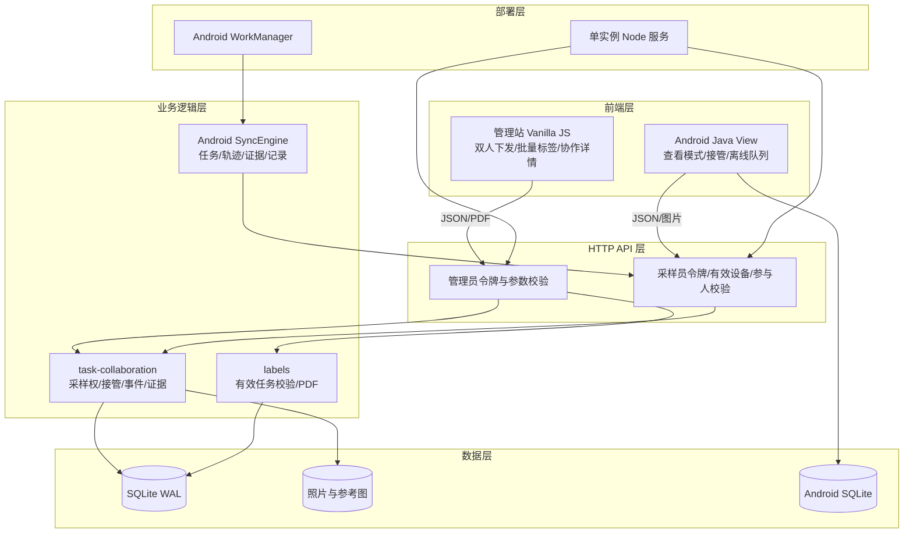
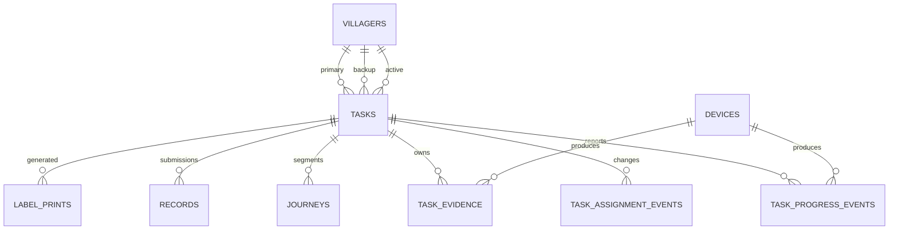
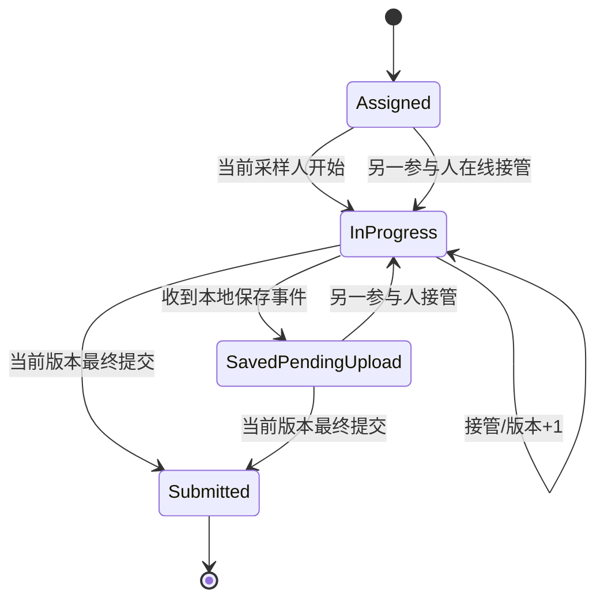

# 双人协作采样与已下发标签打印实施计划

## Goal

在现有 `v1.5.0` 上增加主采样人、备用采样人、唯一当前采样权和在线接管。保留单任务编号、二维码与所有离线证据，并让管理员可以对已下发任务单个或批量补打标签。改造必须兼容旧任务、现有 SQLite 数据和现有 APP 主流程。

## Requirements

- 每个任务有主采样人、可选备用采样人、当前采样人、最终完成人和采样权版本。
- 两名参与人都能同步任务；只有当前采样人能启动、上传位置和提交最终记录。
- 非当前参与人联网输入 `1234`、选择原因后可直接接管；冷却 1 分钟，可反复接管。
- 接管和最终提交使用 SQLite `BEGIN IMMEDIATE` 与版本条件，保证只有一个请求成功。
- 进度事件、接管事件和多份证据按任务合并；旧版本证据可保存但不能覆盖最终状态。
- 管理端支持默认备用人、双人下发、未完成任务调整备用人、协作详情。
- 已下发有效任务支持单个或最多 500 个批量生成标签 PDF；补打提示并记录生成历史。
- Android 保持 Java + View/XML、藏文主行/汉文辅行和 Material Symbols Rounded。
- 服务器、浏览器端到端和 Android 单元/构建测试全部通过。

## Technical Considerations

### System Architecture Overview



### Technology Stack Selection

- 服务端继续使用 Node.js 原生 HTTP、`node:sqlite`、WAL 和 PDFKit，不引入框架。
- 管理站继续使用原生 HTML/CSS/JavaScript，复用现有任务表与弹窗。
- Android 继续使用 Java、AppCompat、Material Components、SQLiteOpenHelper 和 WorkManager。
- 单机 SQLite 足以支撑当前规模；采样权变更使用短事务，不在事务内处理图片或 PDF。

### Integration Points

- `schema.js` 负责向旧库增量加列、建表和回填。
- 新建 `task-collaboration.js`，集中进行任务参与权限、接管、进度聚合和最终提交判定。
- `server.js` 只负责路由、认证、输入和输出，复用协作模块。
- Android `Api`、`Task`、`Store`、`SyncEngine` 承担协议、本地状态和补传。
- `labels.js` 保持单一 PDF 渲染入口；GET 与 POST 标签接口共用任务校验。

### Deployment Architecture

- 沿用现有单 Node 服务与持久化数据目录。
- 数据库迁移在服务启动时幂等执行；发布前先备份 SQLite 和上传目录。
- Android 提升到 `1.6.0`，服务端登记新版本；协作任务要求新版 APP。
- 不新增容器、队列服务或常驻推送进程。

### Scalability Considerations

- 接管只更新一行任务并追加一行事件，事务保持短小。
- 进度接口只返回单任务数据并限制事件数量。
- 标签 POST 每批最多 500 个任务，避免 URL 与内存失控。
- 所有客户端写入使用 UUID 唯一键幂等。

## Database Schema Design



### Table Specifications

- `tasks`：新增 `backup_villager_id`、`active_villager_id`、`final_villager_id`、`assignment_version`、`handover_count`、`last_handover_at`。
- `task_assignment_events`：保存下发、管理员换人和接管历史。
- `task_progress_events`：幂等保存步骤事件与发生/接收时间。
- `task_evidence`：保存扫码/照片证据及 `active/pre_handover/stale_after_handover` 范围。
- `journeys`：新增 `task_id` 与 `assignment_version`，按接管阶段分段。
- `label_prints`：复用现有表记录成功生成 PDF 的任务、编号和时间。

### Indexing Strategy

- `tasks(backup_villager_id, status)`、`tasks(active_villager_id, status)` 支持移动同步与权限判断。
- 事件表按 `(task_id, occurred_at, id)` 索引。
- 证据表按 `(task_id, occurred_at, id)` 索引，客户端 ID 唯一。
- 接管事件按 `(task_id, assignment_version)` 唯一。

### Migration Strategy

1. 新列均允许旧数据平滑加入；版本字段使用默认值 1。
2. 回填 `active_villager_id=villager_id`。
3. 已提交历史任务从主记录设备回填 `final_villager_id`。
4. 不修改编号、二维码和既有记录。
5. 迁移测试覆盖旧版最小表结构和重复启动。

## API Design

### Admin

- `POST /api/v1/admin/tasks`：接受 `primaryVillagerId`、可空 `backupVillagerId`，兼容旧 `villagerId`。
- `PUT /api/v1/admin/tasks/:id/assignees`：未开始可改两人；有进度后只可改非当前备用人。
- `GET/PUT /api/v1/admin/settings/sampling?projectId=`：读取/设置默认备用人。
- `GET /api/v1/admin/tasks/:id/collaboration`：参与人、时间线、轨迹段、证据。
- `POST /api/v1/admin/labels/pdf`：JSON `{taskIds:number[]}`，1—500 个。

### Mobile

- `GET /api/v1/mobile/sync`：返回本人是主或备用的任务及 `viewer/active` 权限。
- `GET /api/v1/mobile/tasks/:id/progress`：返回参与人、当前步骤、位置、时间线。
- `POST /api/v1/mobile/tasks/:id/progress`：幂等批量进度事件。
- `POST /api/v1/mobile/tasks/:id/takeover`：确认码、原因、预期版本、请求 UUID。
- `POST /api/v1/mobile/tasks/:id/record`：增加 `assignmentVersion`；旧版本保存为冲突证据但不完成任务。
- 现有 `start/live/track/schedule` 全部改为参与人与当前采样权校验。

### Error Handling

- `NOT_PARTICIPANT`、`NOT_ACTIVE_COLLECTOR`、`INVALID_CONFIRMATION_CODE` 使用 403。
- `ASSIGNMENT_CHANGED`、`TAKEOVER_COOLDOWN`、`STALE_ASSIGNMENT` 使用 409。
- `TASK_FINISHED`、非法人员组合和标签无效任务使用 422。
- Android 对旧采样权错误停止最终提交重试，保留本地证据状态。

## Frontend Architecture

### Admin Component Hierarchy

```text
任务页面
├── 工具栏
│   ├── 打印所选标签
│   └── 下发采样任务
├── 任务表
│   ├── 行选择框
│   ├── 主/备用/当前人员
│   └── 标签生成次数
├── 下发弹窗
│   ├── 默认主采样人
│   ├── 默认备用采样人
│   └── 点位级人员覆盖
└── 任务详情
    ├── 人员与接管历史
    ├── 进度时间线
    ├── 证据和轨迹段
    └── 打印/补打标签
```

### Android Screen Hierarchy

```text
任务列表（保留左日期/右任务）
└── 任务卡
    ├── 本人角色与当前采样人
    └── 任务详情
        ├── 当前采样人模式：原四步采样
        └── 查看模式
            ├── 进度/位置/最后同步
            ├── 15 秒前台刷新
            └── 接管采样弹窗
```

### State Flow



## Security and Performance

- `1234` 仅防误触；真正权限来自令牌、有效设备和参与人关系。
- 接管和最终提交使用服务器状态，不信任 APP 显示状态。
- 图片处理在事务外完成，事务只处理状态与数据库行。
- 15 秒轮询仅在任务详情前台运行，退出页面立即停止。
- 所有动态 HTML 继续通过现有 `esc()` 转义。
- 标签 PDF 生成成功后才记录 `label_prints` 和审计。

## Implementation Order

1. 增加服务端 schema 与 `task-collaboration.js`，先写单元测试。
2. 扩展管理员和移动接口，完成接管并发、参与人权限、旧版本提交测试。
3. 增加标签 POST 与管理站列表批量打印。
4. 改管理站双人下发、默认备用人、换人与协作详情。
5. 升级 Android 数据模型、同步、查看模式、接管与轮询。
6. 增加离线事件/证据队列和旧采样权降级处理。
7. 更新版本、README 和部署说明。
8. 运行服务器测试、Playwright、Android 单元测试与 `assembleDebug`。

## Verification

- 服务端：`npm test`，并增加双人任务、并发接管、证据合并和批量标签用例。
- 管理站：运行现有 Playwright 测试，补充双人下发和历史任务打印。
- Android：运行 `testDebugUnitTest` 与 `assembleDebug`。
- 手工：两台设备分别作为主/备用，覆盖在线接管、离线保存、接管后补传、重新接管和最终完成。

## Implementation Status（2026-09-14）

- [x] SQLite 增量迁移、人员/采样权版本、接管/进度/证据数据结构。
- [x] 管理端双人下发、项目默认备用人、点位级覆盖、未完成任务换人。
- [x] Android 查看模式、15 秒轮询、`1234` 在线接管、60 秒冷却与离线证据补传。
- [x] 管理端按任务合并两人进度、照片证据和分色轨迹；旧扫码/拍照进度保留。
- [x] 已下发任务单个/批量补打标签，批量上限 500，取消任务拒绝打印。
- [x] 版本提升到 `1.6.0`（versionCode 114）并补充升级部署说明。
- [x] 验证通过：服务端 70/70、管理站 Playwright 47/47、Android `testDebugUnitTest` 与 `assembleDebug`。
- [ ] 两台 Android 真机现场验收与母语藏文校对（发布前人工步骤）。
